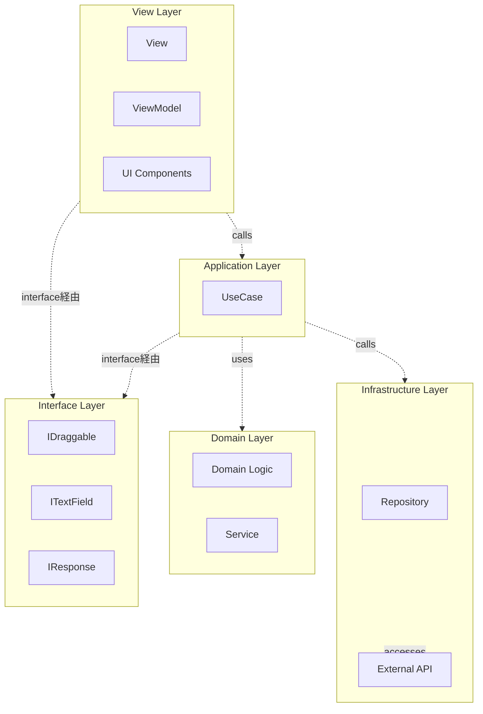
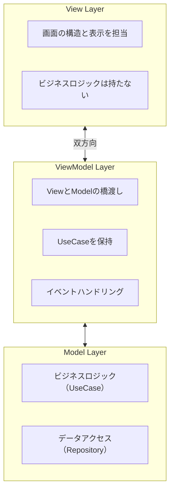
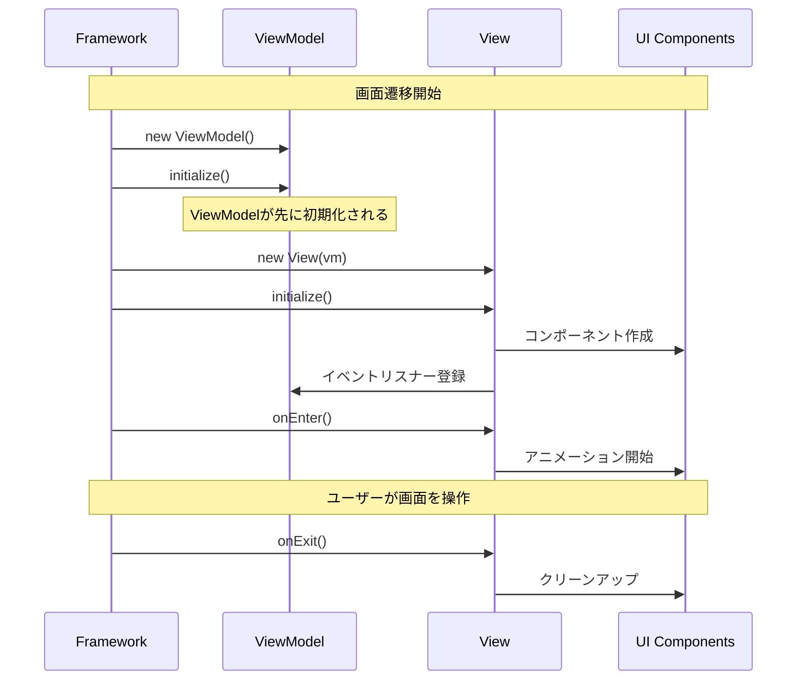

# Next2D Framework Specs - Combined Reference

## Table of Contents

1. [Index - フレームワーク概要](#index---フレームワーク概要)
2. [AnimationTool連携](#animationtool連携)
3. [設定ファイル](#設定ファイル)
4. [ルーティング](#ルーティング)
5. [View と ViewModel](#view-と-viewmodel)

---

# Index - フレームワーク概要

Next2D Framework is an MVVM framework for application development using the Next2D Player. It provides routing, View/ViewModel management, configuration management, and other features for single-page applications (SPAs).

## Key Features

- **MVVM Pattern**: Separation of concerns through Model-View-ViewModel architecture
- **Clean Architecture**: Dependency inversion and loosely coupled design
- **Single Page Application**: Scene management based on URLs
- **Animation Tool Integration**: Integration with assets created in Animation Tool
- **TypeScript Support**: Type-safe development capability
- **Atomic Design**: Component design promoting reusability

## Architecture Overview

This project combines clean architecture with the MVVM pattern.



### Layer Responsibilities

| Layer | Path | Role |
|----------|------|------|
| **View** | `view/*`, `ui/*` | Screen structure and display |
| **ViewModel** | `view/*` | Bridging View and Model, event handling |
| **Interface** | `interface/*` | Abstraction layer, type definitions |
| **Application** | `model/application/*/usecase/*` | Business logic implementation (UseCase) |
| **Domain** | `model/domain/*` | Core business rules |
| **Infrastructure** | `model/infrastructure/repository/*` | Data access, external API integration |

### Dependency Direction

Following clean architecture principles, dependencies always point inward toward the Domain layer.

- **View Layer**: Uses Application layer through interfaces
- **Application Layer**: Uses Domain and Infrastructure layers through interfaces
- **Domain Layer**: Depends on nothing (pure business logic)
- **Infrastructure Layer**: Implements Domain layer interfaces

## Directory Structure

```
my-app/
├── src/
│   ├── config/                    # Configuration files
│   │   ├── stage.json             # Stage configuration
│   │   ├── config.json            # Environment configuration
│   │   ├── routing.json           # Routing configuration
│   │   └── Config.ts              # Type definitions and exports
│   │
│   ├── interface/                 # Interface definitions
│   │   ├── IDraggable.ts          # Draggable objects
│   │   ├── ITextField.ts          # Text field interface
│   │   ├── IHomeTextResponse.ts   # API response type
│   │   └── IViewName.ts           # Screen name type definition
│   │
│   ├── view/                      # View & ViewModel
│   │   ├── top/
│   │   │   ├── TopView.ts         # Screen structure definition
│   │   │   └── TopViewModel.ts    # Business logic bridge
│   │   └── home/
│   │       ├── HomeView.ts
│   │       └── HomeViewModel.ts
│   │
│   ├── model/
│   │   ├── application/           # Application layer
│   │   │   ├── top/
│   │   │   │   └── usecase/
│   │   │   │       └── NavigateToViewUseCase.ts
│   │   │   └── home/
│   │   │       └── usecase/
│   │   │           ├── StartDragUseCase.ts
│   │   │           ├── StopDragUseCase.ts
│   │   │           └── CenterTextFieldUseCase.ts
│   │   │
│   │   ├── domain/                # Domain layer
│   │   │   └── callback/
│   │   │       ├── Background.ts
│   │   │       └── Background/
│   │   │           └── service/
│   │   │               ├── BackgroundDrawService.ts
│   │   │               └── BackgroundChangeScaleService.ts
│   │   │
│   │   └── infrastructure/        # Infrastructure layer
│   │       └── repository/
│   │           └── HomeTextRepository.ts
│   │
│   ├── ui/                        # UI components
│   │   ├── animation/             # Animation definitions
│   │   │   └── top/
│   │   │       └── TopBtnShowAnimation.ts
│   │   │
│   │   ├── component/             # Atomic design
│   │   │   ├── atom/              # Minimal unit components
│   │   │   │   ├── ButtonAtom.ts
│   │   │   │   └── TextAtom.ts
│   │   │   ├── molecule/          # Combined atoms
│   │   │   │   ├── HomeBtnMolecule.ts
│   │   │   │   └── TopBtnMolecule.ts
│   │   │   ├── organism/          # Multiple molecules combined
│   │   │   ├── template/          # Page templates
│   │   │   └── page/              # Page components
│   │   │       ├── top/
│   │   │       │   └── TopPage.ts
│   │   │       └── home/
│   │   │           └── HomePage.ts
│   │   │
│   │   └── content/               # Animation Tool generated content
│   │       ├── TopContent.ts
│   │       └── HomeContent.ts
│   │
│   ├── assets/                    # Static assets
│   │
│   ├── Packages.ts                # Package exports
│   └── index.ts                   # Entry point
│
├── file/                          # Animation Tool output files
│   └── sample.n2d
│
├── mock/                          # Mock data
│   ├── api/                       # API mocks
│   ├── content/                   # Content mocks
│   └── img/                       # Image mocks
│
└── package.json
```

## Framework Flowchart

Detailed flow of screen transitions via the gotoView function.

```mermaid
graph TD
    User([User]) -->|Request| GotoView[gotoView Path]

    GotoView --> LoadingCheck{use loading?<br/>Default: true}

    LoadingCheck -->|YES| ScreenOverlay[Screen Overlay]
    LoadingCheck -->|NO| RemoveResponse
    ScreenOverlay --> LoadingStart[Start Loading]
    LoadingStart --> RemoveResponse

    RemoveResponse[Remove Previous Response Data] --> ParseQuery[Parse Query String]
    ParseQuery --> UpdateHistory{SPA mode?}

    UpdateHistory -->|YES| PushState[Push History State]
    UpdateHistory -->|NO| RequestType
    PushState --> RequestType

    RequestType[Request Type]

    RequestType --> JSON[JSON: Get external JSON data]
    RequestType --> CONTENT[CONTENT: Get Animation Tool JSON]
    RequestType --> CUSTOM[CUSTOM: Request to external API]

    JSON --> CacheCheck{use cache?<br/>Default: false}
    CONTENT --> CacheCheck
    CUSTOM --> CacheCheck

    CacheCheck -->|YES| CacheData[(Cache)]
    CacheCheck -->|NO| GlobalData{{Global Network}}

    CacheData --> Cached{Cached?}

    Cached -->|NO| GlobalData
    Cached -->|YES| RegisterResponse
    GlobalData --> RegisterResponse

    RegisterResponse[Register Response Data] --> RequestCallback{request callback?}

    RequestCallback -->|YES| ExecRequestCallback[Execute Request Callback]
    RequestCallback -->|NO| UnbindView
    ExecRequestCallback --> UnbindView

    UnbindView[Previous View: onExit & Unbind] --> BindView[New View/ViewModel: Bind]
    BindView --> ViewModelInit[ViewModel: initialize]

    ViewModelInit --> ViewInit[View: initialize]
    ViewInit --> AddToStage[Add View to Stage]
    AddToStage --> GotoViewCallback{gotoView callback?}

    GotoViewCallback -->|YES| ExecGotoViewCallback[Execute gotoView Callback]
    GotoViewCallback -->|NO| LoadingEndCheck
    ExecGotoViewCallback --> LoadingEndCheck

    LoadingEndCheck{use loading?<br/>Default: true}

    LoadingEndCheck -->|YES| LoadingEnd[End Loading]
    LoadingEndCheck -->|NO| OnEnter
    LoadingEnd --> DisposeOverlay[Dispose Screen Overlay]
    DisposeOverlay --> OnEnter

    OnEnter[View: onEnter] --> StartDrawing

    StartDrawing[Start Drawing] -->|Response| User

    style User fill:#d5e8d4,stroke:#82b366
    style StartDrawing fill:#dae8fc,stroke:#6c8ebf
    style CacheData fill:#fff2cc,stroke:#d6b656
    style GlobalData fill:#f5f5f5,stroke:#666666
```



### Main Flow Steps

| Step | Description |
|----------|------|
| **gotoView** | Entry point for screen transitions |
| **Loading** | Display/hide loading screen control |
| **Request Type** | Three types of requests: JSON, CONTENT, CUSTOM |
| **Cache** | Response data caching control |
| **View/ViewModel Bind** | New View/ViewModel binding process |
| **onEnter** | Callback after screen display completion |

## Major Design Patterns

### 1. MVVM (Model-View-ViewModel)

- **View**: Handles screen structure and display without business logic
- **ViewModel**: Bridges View and Model, holds UseCases and processes events
- **Model**: Manages business logic and data access

### 2. UseCase Pattern

Create dedicated UseCase classes for each user action:

```typescript
export class StartDragUseCase
{
    execute(target: IDraggable): void
    {
        target.startDrag();
    }
}
```

### 3. Dependency Inversion

Depend on interfaces rather than concrete classes:

```typescript
// Good example: depends on interface
import type { IDraggable } from "@/interface/IDraggable";

function startDrag(target: IDraggable): void
{
    target.startDrag();
}
```

### 4. Repository Pattern

Abstracts data access with error handling:

```typescript
export class HomeTextRepository
{
    static async get(): Promise<IHomeTextResponse>
    {
        try {
            const response = await fetch(`${config.api.endPoint}api/home.json`);
            if (!response.ok) {
                throw new Error(`HTTP error! status: ${response.status}`);
            }
            return await response.json();
        } catch (error) {
            console.error("Failed to fetch:", error);
            throw error;
        }
    }
}
```

## Quick Start

### Project Creation

```bash
npx create-next2d-app my-app
cd my-app
npm install
npm start
```

### Auto-generate View/ViewModel

```bash
npm run generate
```

This command parses the top properties in `routing.json` and generates corresponding View and ViewModel classes.

## Best Practices

1. **Interface First**: Always depend on interfaces rather than concrete types
2. **Single Responsibility Principle**: Each class should have only one responsibility
3. **Dependency Injection**: Inject dependencies through constructors
4. **Error Handling**: Handle errors appropriately in Repository layer
5. **Type Safety**: Use explicit type definitions, avoid `any` type

## Related Documentation

### Basics
- View/ViewModel - Screen display and data binding
- Routing - URL-based screen transitions
- Configuration Files - Environment and stage configuration
- Animation Tool Integration - Leveraging Animation Tool assets

### Next2D Player Integration
- Next2D Player - Rendering engine
- MovieClip - Timeline animation
- Event System - User interaction

---

# AnimationTool連携

Next2D FrameworkはAnimationToolで作成したアセットとシームレスに連携できます。

## 概要

AnimationToolは、Next2D Player用のアニメーションやUIコンポーネントを作成するためのツールです。出力されたJSONファイルをフレームワークで読み込み、MovieClipとして利用できます。

## ディレクトリ構成

```
src/
├── ui/
│   ├── content/              # Animation Tool生成コンテンツ
│   │   ├── TopContent.ts
│   │   └── HomeContent.ts
│   │
│   ├── component/            # Atomic Designコンポーネント
│   │   ├── atom/             # 最小単位のコンポーネント
│   │   │   ├── ButtonAtom.ts
│   │   │   └── TextAtom.ts
│   │   ├── molecule/         # Atomを組み合わせたコンポーネント
│   │   │   ├── TopBtnMolecule.ts
│   │   │   └── HomeBtnMolecule.ts
│   │   ├── organism/         # 複数Moleculeの組み合わせ
│   │   ├── template/         # ページテンプレート
│   │   └── page/             # ページコンポーネント
│   │       ├── top/
│   │       │   └── TopPage.ts
│   │       └── home/
│   │           └── HomePage.ts
│   │
│   └── animation/            # コードアニメーション定義
│       └── top/
│           └── TopBtnShowAnimation.ts
│
└── file/                     # Animation Tool出力ファイル
    └── sample.n2d
```

## MovieClipContent

Animation Toolで作成したコンテンツをラップするクラスです。

### 基本構造

```typescript
import { MovieClipContent } from "@next2d/framework";

/**
 * @see file/sample.n2d
 */
export class TopContent extends MovieClipContent
{
    /**
     * Animation Tool上で設定したシンボル名を返す
     */
    get namespace(): string
    {
        return "TopContent";
    }
}
```

### namespaceの役割

`namespace`プロパティは、Animation Toolで作成したシンボルの名前と一致させます。この名前を使って、読み込まれたJSONデータから対応するMovieClipが生成されます。

## コンテンツの読み込み

### routing.jsonでの設定

Animation ToolのJSONファイルは`routing.json`の`requests`で読み込みます。

```json
{
    "@sample": {
        "requests": [
            {
                "type": "content",
                "path": "{{ content.endPoint }}content/sample.json",
                "name": "MainContent",
                "cache": true
            }
        ]
    },
    "top": {
        "requests": [
            {
                "type": "cluster",
                "path": "@sample"
            }
        ]
    }
}
```

#### request設定

| プロパティ | 型 | 説明 |
|-----------|------|------|
| `type` | string | `"content"` を指定 |
| `path` | string | JSONファイルへのパス |
| `name` | string | レスポンスに登録されるキー名 |
| `cache` | boolean | キャッシュするかどうか |

#### cluster機能

`@`で始まるキーはクラスターとして定義され、複数のルートで共有できます。`type: "cluster"`で参照します。

```json
{
    "@common": {
        "requests": [
            {
                "type": "content",
                "path": "{{ content.endPoint }}common.json",
                "name": "CommonContent",
                "cache": true
            }
        ]
    },
    "top": {
        "requests": [
            { "type": "cluster", "path": "@common" }
        ]
    },
    "home": {
        "requests": [
            { "type": "cluster", "path": "@common" }
        ]
    }
}
```

## 関連項目

- View/ViewModel
- ルーティング
- 設定ファイル

---

# 設定ファイル

Next2D Frameworkの設定は3つのJSONファイルで管理します。

## ファイル構成

```
src/config/
├── stage.json     # 表示領域の設定
├── config.json    # 環境設定
└── routing.json   # ルーティング設定
```

## stage.json

表示領域（Stage）の設定を行うJSONファイルです。

```json
{
    "width": 1920,
    "height": 1080,
    "fps": 60,
    "options": {
        "fullScreen": true,
        "tagId": null,
        "bgColor": "transparent"
    }
}
```

### プロパティ

| プロパティ | 型 | デフォルト | 説明 |
|-----------|------|----------|------|
| `width` | number | 240 | 表示領域の幅 |
| `height` | number | 240 | 表示領域の高さ |
| `fps` | number | 60 | 1秒間に何回描画するか（1〜60） |
| `options` | object | null | オプション設定 |

### options設定

| プロパティ | 型 | デフォルト | 説明 |
|-----------|------|----------|------|
| `fullScreen` | boolean | false | Stageで設定した幅と高さを超えて画面全体に描画 |
| `tagId` | string | null | IDを指定すると、指定したIDのエレメント内で描画を行う |
| `bgColor` | string | "transparent" | 背景色を16進数で指定。デフォルトは無色透明 |

## config.json

環境ごとの設定を管理するファイルです。`local`、`dev`、`stg`、`prd`、`all`と区切られており、`all`以外は任意の環境名です。

```json
{
    "local": {
        "api": {
            "endPoint": "http://localhost:3000/"
        },
        "content": {
            "endPoint": "http://localhost:5500/"
        }
    },
    "dev": {
        "api": {
            "endPoint": "https://dev-api.example.com/"
        }
    },
    "prd": {
        "api": {
            "endPoint": "https://api.example.com/"
        }
    },
    "all": {
        "spa": true,
        "defaultTop": "top",
        "loading": {
            "callback": "Loading"
        },
        "gotoView": {
            "callback": ["callback.Background"]
        }
    }
}
```

### all設定

`all`はどの環境でも書き出される共通変数です。

| プロパティ | 型 | デフォルト | 説明 |
|-----------|------|----------|------|
| `spa` | boolean | true | Single Page ApplicationとしてURLでシーンを制御 |
| `defaultTop` | string | "top" | ページトップのView。設定がない場合はTopViewクラスが起動 |
| `loading.callback` | string | Loading | ローディング画面のクラス名。start関数とend関数を呼び出す |
| `gotoView.callback` | string \| array | ["callback.Background"] | gotoView完了後のコールバッククラス |

### platform設定

ビルド時の`--platform`で指定した値がセットされます。

対応値: `macos`, `windows`, `linux`, `ios`, `android`, `web`

```typescript
import { config } from "@/config/Config";

if (config.platform === "ios") {
    // iOS固有の処理
}
```

## routing.json

ルーティングの設定ファイルです。詳細は[ルーティング](#ルーティング)を参照してください。

```json
{
    "top": {
        "requests": [
            {
                "type": "json",
                "path": "{{api.endPoint}}api/top.json",
                "name": "TopText"
            }
        ]
    },
    "home": {
        "requests": []
    }
}
```

## 設定値の取得

コード内で設定値を取得するには`config`オブジェクトを使用します。

### Config.tsの例

```typescript
import stageJson from "./stage.json";
import configJson from "./config.json";

interface IStageConfig {
    width: number;
    height: number;
    fps: number;
    options: {
        fullScreen: boolean;
        tagId: string | null;
        bgColor: string;
    };
}

interface IConfig {
    stage: IStageConfig;
    api: {
        endPoint: string;
    };
    content: {
        endPoint: string;
    };
    spa: boolean;
    defaultTop: string;
    platform: string;
}

export const config: IConfig = {
    stage: stageJson,
    ...configJson
};
```

### 使用例

```typescript
import { config } from "@/config/Config";

// ステージ設定
const stageWidth = config.stage.width;
const stageHeight = config.stage.height;

// API設定
const apiEndPoint = config.api.endPoint;

// SPA設定
const isSpa = config.spa;
```

## ローディング画面

`loading.callback`で設定したクラスの`start`関数と`end`関数が呼び出されます。

```typescript
export class Loading
{
    private shape: Shape;

    constructor()
    {
        this.shape = new Shape();
        // ローディング表示の初期化
    }

    start(): void
    {
        // ローディング開始時の処理
        stage.addChild(this.shape);
    }

    end(): void
    {
        // ローディング終了時の処理
        this.shape.remove();
    }
}
```

## gotoViewコールバック

`gotoView.callback`で設定したクラスの`execute`関数が呼び出されます。複数のクラスを配列で設定でき、async/awaitで順次実行されます。

```typescript
import { app } from "@next2d/framework";
import { Shape, stage } from "@next2d/display";

export class Background
{
    public readonly shape: Shape;

    constructor()
    {
        this.shape = new Shape();
    }

    execute(): void
    {
        const context = app.getContext();
        const view = context.view;
        if (!view) return;

        // 背景を最背面に配置
        view.addChildAt(this.shape, 0);
    }
}
```

## ビルドコマンド

環境を指定してビルド:

```bash
# ローカル環境
npm run build -- --env=local

# 開発環境
npm run build -- --env=dev

# 本番環境
npm run build -- --env=prd
```

プラットフォームを指定:

```bash
npm run build -- --platform=web
npm run build -- --platform=ios
npm run build -- --platform=android
```

## 設定例

### 完全な設定ファイルの例

#### stage.json

```json
{
    "width": 1920,
    "height": 1080,
    "fps": 60,
    "options": {
        "fullScreen": true,
        "tagId": null,
        "bgColor": "#1461A0"
    }
}
```

#### config.json

```json
{
    "local": {
        "api": {
            "endPoint": "http://localhost:3000/"
        },
        "content": {
            "endPoint": "http://localhost:5500/mock/content/"
        }
    },
    "dev": {
        "api": {
            "endPoint": "https://dev-api.example.com/"
        },
        "content": {
            "endPoint": "https://dev-cdn.example.com/content/"
        }
    },
    "prd": {
        "api": {
            "endPoint": "https://api.example.com/"
        },
        "content": {
            "endPoint": "https://cdn.example.com/content/"
        }
    },
    "all": {
        "spa": true,
        "defaultTop": "top",
        "loading": {
            "callback": "Loading"
        },
        "gotoView": {
            "callback": ["callback.Background"]
        }
    }
}
```

## 関連項目

- [ルーティング](#ルーティング)
- [View/ViewModel](#view-と-viewmodel)

---

# ルーティング

Next2D FrameworkはシングルページアプリケーションとしてURLでシーンを制御できます。ルーティングは`routing.json`で設定します。

## 基本設定

ルーティングのトッププロパティは英数字とスラッシュが使用できます。スラッシュをキーにCamelCaseでViewクラスにアクセスします。

```json
{
    "top": {
        "requests": []
    },
    "home": {
        "requests": []
    },
    "quest/list": {
        "requests": []
    }
}
```

上記の場合:
- `top` → `TopView`クラス
- `home` → `HomeView`クラス
- `quest/list` → `QuestListView`クラス

## ルート定義

### 基本的なルート

```json
{
    "top": {
        "requests": []
    }
}
```

アクセス: `https://example.com/` または `https://example.com/top`

### セカンドレベルプロパティ

| プロパティ | 型 | デフォルト | 説明 |
|-----------|------|----------|------|
| `private` | boolean | false | URLでの直接アクセスを制御。trueの場合、URLでアクセスするとTopViewが読み込まれる |
| `requests` | array | null | Viewがbindされる前にリクエストを送信 |

### プライベートルート

URLでの直接アクセスを禁止したい場合:

```json
{
    "quest/detail": {
        "private": true,
        "requests": []
    }
}
```

`private: true`の場合、URLで直接アクセスすると`TopView`にリダイレクトされます。プログラムからの`app.gotoView()`でのみアクセス可能です。

## requestsの設定

Viewがbindされる前にデータを取得できます。取得したデータは`app.getResponse()`で取得できます。

### requests配列の設定項目

| プロパティ | 型 | デフォルト | 説明 |
|-----------|------|----------|------|
| `type` | string | content | `json`、`content`、`custom`の固定値 |
| `path` | string | empty | リクエスト先のパス |
| `name` | string | empty | `response`にセットするキー名 |
| `cache` | boolean | false | データをキャッシュするか |
| `callback` | string \| array | null | リクエスト完了後のコールバッククラス |
| `class` | string | empty | リクエストを実行するクラス（typeがcustomの場合のみ） |
| `access` | string | public | 関数へのアクセス修飾子（`public`または`static`） |
| `method` | string | empty | 実行する関数名（typeがcustomの場合のみ） |

### typeの種類

#### json

外部JSONデータを取得:

```json
{
    "home": {
        "requests": [
            {
                "type": "json",
                "path": "{{api.endPoint}}api/home.json",
                "name": "HomeData"
            }
        ]
    }
}
```

#### content

Animation ToolのJSONを取得:

```json
{
    "top": {
        "requests": [
            {
                "type": "content",
                "path": "{{content.endPoint}}top.json",
                "name": "TopContent"
            }
        ]
    }
}
```

#### custom

カスタムクラスでリクエストを実行:

```json
{
    "user/profile": {
        "requests": [
            {
                "type": "custom",
                "class": "repository.UserRepository",
                "access": "static",
                "method": "getProfile",
                "name": "UserProfile"
            }
        ]
    }
}
```

### 変数の展開

`{{***}}`で囲むと`config.json`の変数を取得できます:

```json
{
    "path": "{{api.endPoint}}path/to/api"
}
```

### キャッシュの利用

`cache: true`を設定すると、データがキャッシュされます。キャッシュしたデータは画面遷移しても初期化されません。

```json
{
    "top": {
        "requests": [
            {
                "type": "json",
                "path": "{{api.endPoint}}api/master.json",
                "name": "MasterData",
                "cache": true
            }
        ]
    }
}
```

キャッシュデータの取得:

```typescript
import { app } from "@next2d/framework";

const cache = app.getCache();
if (cache.has("MasterData")) {
    const masterData = cache.get("MasterData");
}
```

### コールバック

リクエスト完了後にコールバックを実行:

```json
{
    "home": {
        "requests": [
            {
                "type": "json",
                "path": "{{api.endPoint}}api/home.json",
                "name": "HomeData",
                "callback": "callback.HomeDataCallback"
            }
        ]
    }
}
```

コールバッククラス:

```typescript
export class HomeDataCallback
{
    constructor(data: any)
    {
        // 取得したデータが渡される
    }

    execute(): void
    {
        // コールバック処理
    }
}
```

## 画面遷移

### app.gotoView()

`app.gotoView()`で画面遷移を行います:

```typescript
import { app } from "@next2d/framework";

// 基本的な遷移
await app.gotoView("home");

// パスで遷移
await app.gotoView("quest/list");

// クエリパラメータ付き
await app.gotoView("quest/detail?id=123");
```

### UseCaseでの画面遷移

画面遷移はUseCaseで行うことを推奨します:

```typescript
import { app } from "@next2d/framework";

export class NavigateToViewUseCase
{
    async execute(viewName: string): Promise<void>
    {
        await app.gotoView(viewName);
    }
}
```

ViewModelでの使用:

```typescript
export class TopViewModel extends ViewModel
{
    private readonly navigateToViewUseCase: NavigateToViewUseCase;

    constructor()
    {
        super();
        this.navigateToViewUseCase = new NavigateToViewUseCase();
    }

    async onClickStartButton(): Promise<void>
    {
        await this.navigateToViewUseCase.execute("home");
    }
}
```

## レスポンスデータの取得

`requests`で取得したデータは`app.getResponse()`で取得できます:

```typescript
import { app } from "@next2d/framework";

async initialize(): Promise<void>
{
    const response = app.getResponse();

    if (response.has("TopText")) {
        const topText = response.get("TopText") as { word: string };
        this.text = topText.word;
    }
}
```

**注意:** `response`データは画面遷移すると初期化されます。画面を跨いで保持したいデータは`cache: true`を設定してください。

## SPAモード

`config.json`の`all.spa`で設定します:

```json
{
    "all": {
        "spa": true
    }
}
```

- `true`: URLでシーンを制御（History API使用）
- `false`: URLによるシーン制御を無効化

## デフォルトのトップページ

`config.json`で設定:

```json
{
    "all": {
        "defaultTop": "top"
    }
}
```

設定がない場合は`TopView`クラスが起動します。

## View/ViewModelの自動生成

`routing.json`の設定から自動生成できます:

```bash
npm run generate
```

このコマンドは`routing.json`のトッププロパティを解析し、対応するViewとViewModelクラスを生成します。

## 設定例

### 完全な routing.json の例

```json
{
    "top": {
        "requests": [
            {
                "type": "json",
                "path": "{{api.endPoint}}api/top.json",
                "name": "TopText"
            }
        ]
    },
    "home": {
        "requests": [
            {
                "type": "json",
                "path": "{{api.endPoint}}api/home.json",
                "name": "HomeData"
            },
            {
                "type": "content",
                "path": "{{content.endPoint}}home.json",
                "name": "HomeContent",
                "cache": true
            }
        ]
    },
    "quest/list": {
        "requests": [
            {
                "type": "custom",
                "class": "repository.QuestRepository",
                "access": "static",
                "method": "getList",
                "name": "QuestList"
            }
        ]
    },
    "quest/detail": {
        "private": true,
        "requests": [
            {
                "type": "custom",
                "class": "repository.QuestRepository",
                "access": "static",
                "method": "getDetail",
                "name": "QuestDetail"
            }
        ]
    }
}
```

## 関連項目

- [View/ViewModel](#view-と-viewmodel)
- [設定ファイル](#設定ファイル)

---

# View と ViewModel

Next2D FrameworkはMVVM（Model-View-ViewModel）パターンを採用しています。1画面にViewとViewModelをワンセット作成するのが基本スタイルです。

## アーキテクチャ



## ディレクトリ構造

```
src/
└── view/
    ├── top/
    │   ├── TopView.ts
    │   └── TopViewModel.ts
    └── home/
        ├── HomeView.ts
        └── HomeViewModel.ts
```

## View

Viewはメインコンテキストにアタッチされるコンテナです。Viewは表示構造のみを担当し、ビジネスロジックはViewModelに委譲します。

### Viewの責務

- **画面の構造定義** - UIコンポーネントの配置と座標設定
- **イベントリスナーの登録** - ViewModelのメソッドと接続
- **ライフサイクル管理** - `initialize`, `onEnter`, `onExit`

### 基本構造

```typescript
import type { TopViewModel } from "./TopViewModel";
import { View } from "@next2d/framework";
import { TopPage } from "@/ui/component/page/top/TopPage";

export class TopView extends View<TopViewModel>
{
    private readonly _topPage: TopPage;

    constructor(vm: TopViewModel)
    {
        super(vm);
        this._topPage = new TopPage();
        this.addChild(this._topPage);
    }

    async initialize(): Promise<void>
    {
        this._topPage.initialize(this.vm);
    }

    async onEnter(): Promise<void>
    {
        await this._topPage.onEnter();
    }

    async onExit(): Promise<void>
    {
        return void 0;
    }
}
```

### ライフサイクル



#### initialize() - 初期化

**呼び出しタイミング:**
- Viewのインスタンスが生成された直後
- 画面遷移時に1回だけ呼び出される
- ViewModelの`initialize()`より**後**に実行される

**主な用途:**
- UIコンポーネントの生成と配置
- イベントリスナーの登録
- 子要素の追加（`addChild`）

```typescript
async initialize(): Promise<void>
{
    const { HomeBtnMolecule } = await import("@/ui/component/molecule/HomeBtnMolecule");
    const { PointerEvent } = next2d.events;

    const homeContent = new HomeBtnMolecule();
    homeContent.x = 120;
    homeContent.y = 120;

    // イベントをViewModelに委譲
    homeContent.addEventListener(
        PointerEvent.POINTER_DOWN,
        this.vm.homeContentPointerDownEvent
    );

    this.addChild(homeContent);
}
```

#### onEnter() - 画面表示時

**呼び出しタイミング:**
- `initialize()`の実行完了後
- 画面が表示される直前

**主な用途:**
- 入場アニメーションの開始
- タイマーやインターバルの開始
- フォーカス設定

```typescript
async onEnter(): Promise<void>
{
    const topBtn = this.getChildByName("topBtn") as TopBtnMolecule;
    topBtn.playEntrance(() => {
        console.log("アニメーション完了");
    });
}
```

#### onExit() - 画面非表示時

**呼び出しタイミング:**
- 別の画面に遷移する直前
- Viewが破棄される前

**主な用途:**
- アニメーションの停止
- タイマーやインターバルのクリア
- リソースの解放

```typescript
async onExit(): Promise<void>
{
    if (this.autoSlideTimer) {
        clearInterval(this.autoSlideTimer);
        this.autoSlideTimer = null;
    }
}
```

## ViewModel

ViewModelはViewとModelの橋渡しを行います。UseCaseを保持し、Viewからのイベントを処理してビジネスロジックを実行します。

### ViewModelの責務

- **イベント処理** - Viewからのイベントを受け取る
- **UseCaseの実行** - ビジネスロジックを呼び出す
- **依存性の管理** - UseCaseのインスタンスを保持
- **状態管理** - 画面固有の状態を管理

### 基本構造

```typescript
import { ViewModel, app } from "@next2d/framework";
import { NavigateToViewUseCase } from "@/model/application/top/usecase/NavigateToViewUseCase";

export class TopViewModel extends ViewModel
{
    private readonly navigateToViewUseCase: NavigateToViewUseCase;
    private topText: string = "";

    constructor()
    {
        super();
        this.navigateToViewUseCase = new NavigateToViewUseCase();
    }

    async initialize(): Promise<void>
    {
        // routing.jsonのrequestsで取得したデータを受け取る
        const response = app.getResponse();
        this.topText = response.has("TopText")
            ? (response.get("TopText") as { word: string }).word
            : "";
    }

    getTopText(): string
    {
        return this.topText;
    }

    async onClickStartButton(): Promise<void>
    {
        await this.navigateToViewUseCase.execute("home");
    }
}
```

### ViewModelの初期化タイミング

**重要: ViewModelの`initialize()`はViewの`initialize()`より前に呼び出されます。**

```
1. ViewModel のインスタンス生成
   ↓
2. ViewModel.initialize() ← ViewModelが先
   ↓
3. View のインスタンス生成（ViewModelを注入）
   ↓
4. View.initialize()
   ↓
5. View.onEnter()
```

これにより、Viewの初期化時にはViewModelのデータが既に準備されています。

```typescript
// HomeViewModel.ts
export class HomeViewModel extends ViewModel
{
    private homeText: string = "";

    async initialize(): Promise<void>
    {
        // ViewModelのinitializeで事前にデータ取得
        const data = await HomeTextRepository.get();
        this.homeText = data.word;
    }

    getHomeText(): string
    {
        return this.homeText;
    }
}

// HomeView.ts
export class HomeView extends View<HomeViewModel>
{
    constructor(private readonly vm: HomeViewModel)
    {
        super();
    }

    async initialize(): Promise<void>
    {
        // この時点でvm.initialize()は既に完了している
        const text = this.vm.getHomeText();

        // 取得済みのデータを使ってUIを構築
        const textField = new TextAtom(text);
        this.addChild(textField);
    }
}
```

## 画面遷移

画面遷移には`app.gotoView()`を使用します。

```typescript
import { app } from "@next2d/framework";

// 指定のViewに遷移
await app.gotoView("home");

// パラメータ付きで遷移
await app.gotoView("user/detail?id=123");
```

### UseCaseでの画面遷移

```typescript
import { app } from "@next2d/framework";

export class NavigateToViewUseCase
{
    async execute(viewName: string): Promise<void>
    {
        await app.gotoView(viewName);
    }
}
```

## レスポンスデータの取得

`routing.json`で設定した`requests`のデータは`app.getResponse()`で取得できます。

```typescript
import { app } from "@next2d/framework";

async initialize(): Promise<void>
{
    const response = app.getResponse();

    if (response.has("UserData")) {
        const userData = response.get("UserData");
        this.userName = userData.name;
    }
}
```

## キャッシュデータの取得

`cache: true`を設定したデータは`app.getCache()`で取得できます。

```typescript
import { app } from "@next2d/framework";

const cache = app.getCache();
if (cache.has("MasterData")) {
    const masterData = cache.get("MasterData");
}
```

## 設計原則

### 1. 関心の分離

```typescript
// 良い例: Viewは表示のみ、ViewModelはロジック
class HomeView extends View<HomeViewModel>
{
    async initialize(): Promise<void>
    {
        const btn = new HomeBtnMolecule();
        btn.addEventListener(PointerEvent.POINTER_DOWN, this.vm.onClick);
    }
}

class HomeViewModel extends ViewModel
{
    onClick(event: PointerEvent): void
    {
        this.someUseCase.execute();
    }
}
```

### 2. 依存性の逆転

ViewModelはインターフェースに依存し、具象クラスに依存しません。

```typescript
// 良い例: インターフェースに依存
homeContentPointerDownEvent(event: PointerEvent): void
{
    const target = event.currentTarget as unknown as IDraggable;
    this.startDragUseCase.execute(target);
}
```

### 3. イベントは必ずViewModelに委譲

View内でイベント処理を完結させず、必ずViewModelに委譲します。

## View/ViewModel作成のテンプレート

### View

```typescript
import type { YourViewModel } from "./YourViewModel";
import { View } from "@next2d/framework";

export class YourView extends View<YourViewModel>
{
    constructor(vm: YourViewModel)
    {
        super(vm);
    }

    async initialize(): Promise<void>
    {
        // UIコンポーネントの作成と配置
    }

    async onEnter(): Promise<void>
    {
        // 画面表示時の処理
    }

    async onExit(): Promise<void>
    {
        // 画面非表示時の処理
    }
}
```

### ViewModel

```typescript
import { ViewModel } from "@next2d/framework";
import { YourUseCase } from "@/model/application/your/usecase/YourUseCase";

export class YourViewModel extends ViewModel
{
    private readonly yourUseCase: YourUseCase;

    constructor()
    {
        super();
        this.yourUseCase = new YourUseCase();
    }

    async initialize(): Promise<void>
    {
        return void 0;
    }

    yourEventHandler(event: Event): void
    {
        this.yourUseCase.execute();
    }
}
```

## 関連項目

- [ルーティング](#ルーティング)
- [設定ファイル](#設定ファイル)
