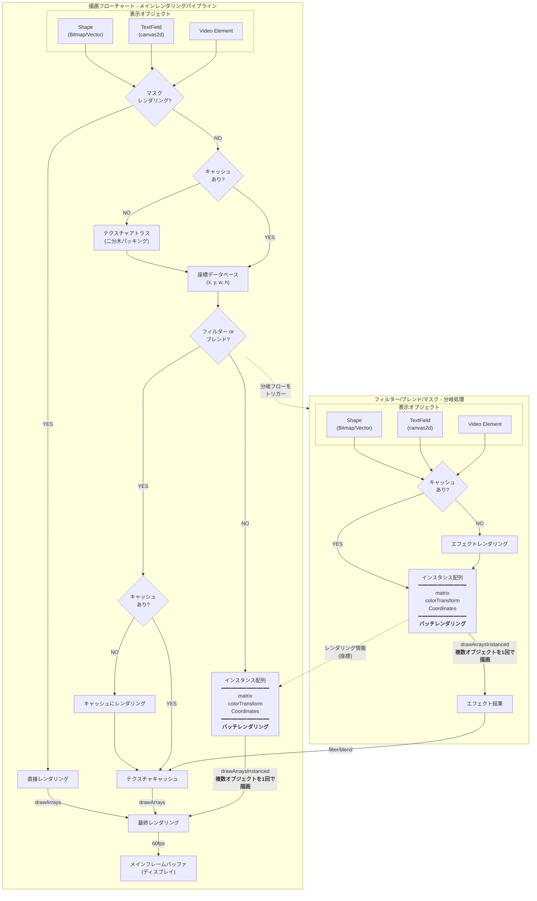
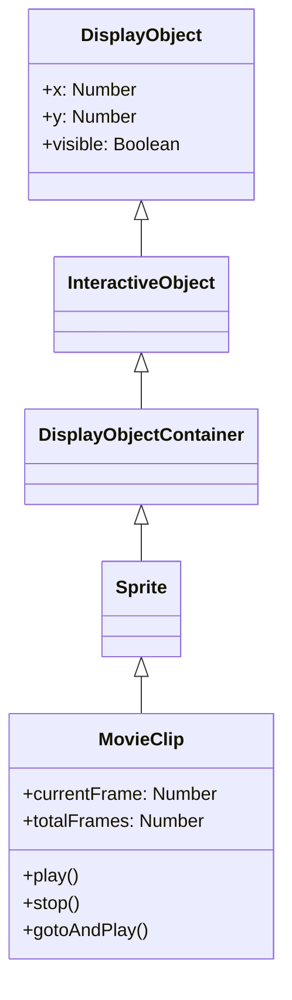
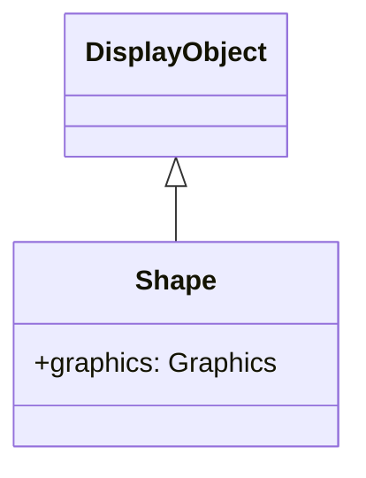
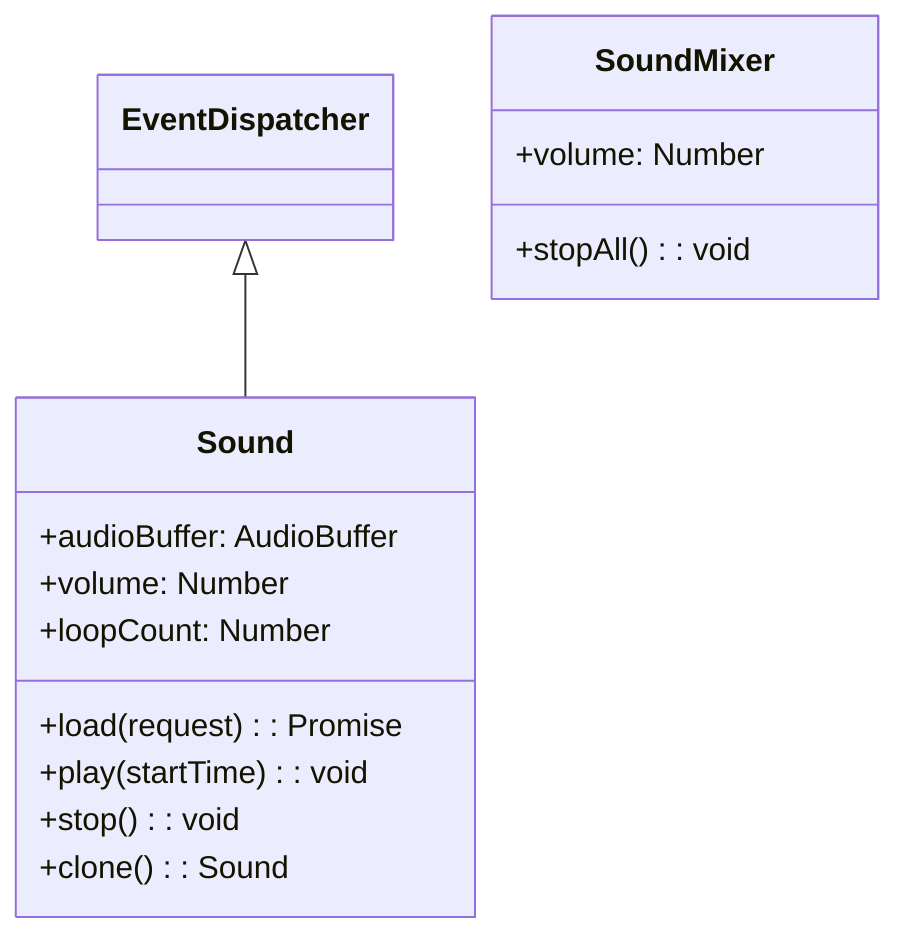
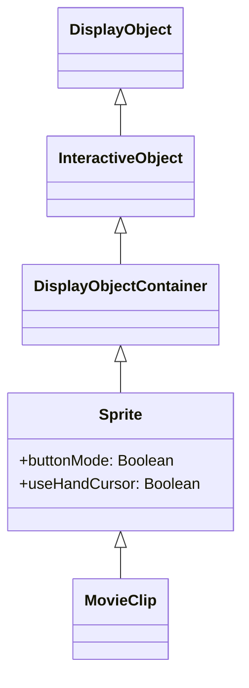
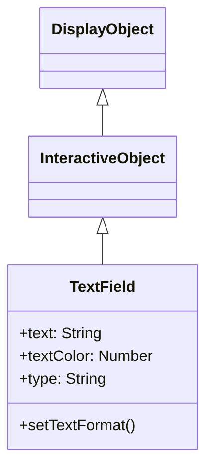
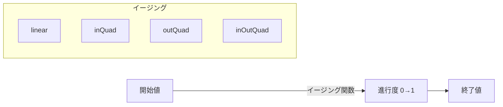
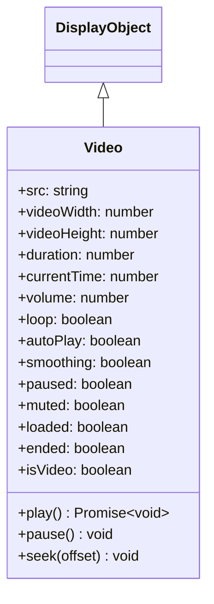

# Next2D Player - API Reference

## Table of Contents

1. [Overview](#next2d-player)
2. [DisplayObject](#displayobject)
3. [Events](#イベントシステム)
4. [MovieClip](#movieclip)
5. [Shape](#shape)
6. [Sound](#サウンド)
7. [Sprite](#sprite)
8. [TextField](#textfield)
9. [Tween](#tweenアニメーション)
10. [Video](#video)
11. [Filters](#フィルター)

---

# Next2D Player

Next2D Playerは、WebGL/WebGPUを用いた高速2Dレンダリングエンジンです。Flash Playerのような機能をWeb上で実現し、ベクター描画、Tweenアニメーション、テキスト、音声、動画など、さまざまな要素をサポートしています。

## 主な特徴

- **高速レンダリング**: WebGL/WebGPUを活用した高速2D描画
- **マルチプラットフォーム**: デスクトップからモバイルまで対応
- **Flash互換API**: swf2jsから派生した馴染みやすいAPI設計
- **豊富なフィルター**: Blur、DropShadow、Glow、Bevelなど多数のフィルターをサポート

## レンダリングパイプライン

Next2D Playerの高速レンダリングを実現するパイプラインの全体像です。



### パイプラインの特徴

- **バッチレンダリング**: 複数のオブジェクトを1回のGPUコールで描画
- **テクスチャキャッシュ**: フィルターやブレンド効果を効率的に処理
- **二分木パッキング**: テクスチャアトラスで最適なメモリ使用
- **60fps描画**: 高フレームレートでのスムーズなアニメーション

## DisplayListアーキテクチャ

Next2D Playerは、Flash Playerと同様のDisplayListアーキテクチャを採用しています。

### 主要クラス階層

```
DisplayObject (基底クラス)
├── InteractiveObject
│   ├── DisplayObjectContainer
│   │   ├── Sprite
│   │   ├── MovieClip
│   │   └── Stage
│   └── TextField
├── Shape
├── Video
└── Bitmap
```

### DisplayObjectContainer

子オブジェクトを持つことができるコンテナクラス：

- `addChild(child)`: 子要素を最前面に追加
- `addChildAt(child, index)`: 指定インデックスに子要素を追加
- `removeChild(child)`: 子要素を削除
- `getChildAt(index)`: インデックスから子要素を取得
- `getChildByName(name)`: 名前から子要素を取得

### MovieClip

タイムラインアニメーションを持つDisplayObject：

- `play()`: タイムラインを再生
- `stop()`: タイムラインを停止
- `gotoAndPlay(frame)`: 指定フレームに移動して再生
- `gotoAndStop(frame)`: 指定フレームに移動して停止
- `currentFrame`: 現在のフレーム番号
- `totalFrames`: 総フレーム数

## 基本的な使い方

```typescript
const { MovieClip } = next2d.display;
const { DropShadowFilter } = next2d.filters;

// ルートMovieClipを作成
const root = await next2d.createRootMovieClip(800, 600, 60, {
    tagId: "container",
    bgColor: "#ffffff"
});

// MovieClipの作成
const mc = new MovieClip();
root.addChild(mc);

// 位置とサイズの設定
mc.x = 100;
mc.y = 100;
mc.scaleX = 2;
mc.scaleY = 2;
mc.rotation = 45;

// フィルターの適用
mc.filters = [
    new DropShadowFilter(4, 45, 0x000000, 0.5)
];
```

## JSONデータの読み込み

Open Animation Toolで作成したJSONファイルを読み込んで描画：

```typescript
const { Loader } = next2d.display;
const { URLRequest } = next2d.net;

const loader = new Loader();
await loader.load(new URLRequest("animation.json"));

// 読み込み完了後、直接contentにアクセス
const mc = loader.content;
stage.addChild(mc);
```

## 関連ドキュメント

### 表示オブジェクト
- [DisplayObject](/ja/reference/player/display-object) - 全ての表示オブジェクトの基底クラス
- [MovieClip](/ja/reference/player/movie-clip) - タイムラインアニメーション
- [Sprite](/ja/reference/player/sprite) - グラフィックス描画とインタラクション
- [Shape](/ja/reference/player/shape) - 軽量なベクター描画
- [TextField](/ja/reference/player/text-field) - テキスト表示と入力
- [Video](/ja/reference/player/video) - 動画再生

### システム
- [イベントシステム](/ja/reference/player/events) - マウス、キーボード、タッチイベント
- [フィルター](/ja/reference/player/filters) - Blur、DropShadow、Glowなど
- [サウンド](/ja/reference/player/sound) - 音声再生とサウンドエフェクト
- [Tweenアニメーション](/ja/reference/player/tween) - プログラムによるアニメーション


---

# DisplayObject

DisplayObjectは、Next2D Playerにおける全ての表示オブジェクトの基底クラスです。

## プロパティ (Properties)

### 読み取り専用プロパティ

| プロパティ | 型 | 説明 |
|-----------|------|------|
| `instanceId` | number | DisplayObjectのユニークなインスタンスID |
| `isSprite` | boolean | Spriteの機能を所持しているかを返却 |
| `isInteractive` | boolean | InteractiveObjectの機能を所持しているかを返却 |
| `isContainerEnabled` | boolean | コンテナの機能を所持しているかを返却 |
| `isTimelineEnabled` | boolean | MovieClipの機能を所持しているかを返却 |
| `isShape` | boolean | Shapeの機能を所持しているかを返却 |
| `isVideo` | boolean | Videoの機能を所持しているかを返却 |
| `isText` | boolean | Textの機能を所持しているかを返却 |
| `concatenatedMatrix` | Matrix | ルートレベルまでの結合された変換行列 |
| `dropTarget` | DisplayObject \| null | スプライトのドラッグ先またはドロップされた先の表示オブジェクト |
| `loaderInfo` | LoaderInfo \| null | この表示オブジェクトが属するファイルの読み込み情報 |
| `mouseX` | number | 対象のDisplayObjectの基準点からのマウスのX座標（ピクセル） |
| `mouseY` | number | 対象のDisplayObjectの基準点からのマウスのY座標（ピクセル） |
| `root` | MovieClip \| Sprite \| null | DisplayObjectのルートであるDisplayObjectContainer |

### 読み書きプロパティ

| プロパティ | 型 | 説明 |
|-----------|------|------|
| `name` | string | 名前。getChildByName()で使用される（デフォルト: ""） |
| `startFrame` | number | 開始フレーム（デフォルト: 1） |
| `endFrame` | number | 終了フレーム（デフォルト: 0） |
| `isMask` | boolean | マスクとしてDisplayObjectにセットされているかを示す（デフォルト: false） |
| `parent` | Sprite \| MovieClip \| null | このDisplayObjectの親のDisplayObjectContainer |
| `alpha` | number | アルファ透明度値（0.0～1.0、デフォルト: 1.0） |
| `blendMode` | string | 使用するブレンドモード（デフォルト: BlendMode.NORMAL） |
| `filters` | Array \| null | 表示オブジェクトに関連付けられている各フィルターオブジェクトの配列 |
| `height` | number | 表示オブジェクトの高さ（ピクセル単位） |
| `width` | number | 表示オブジェクトの幅（ピクセル単位） |
| `colorTransform` | ColorTransform | 表示オブジェクトのColorTransform |
| `matrix` | Matrix | 表示オブジェクトのMatrix |
| `rotation` | number | DisplayObjectインスタンスの回転角度（度単位） |
| `scale9Grid` | Rectangle \| null | 現在有効な拡大/縮小グリッド |
| `scaleX` | number | 基準点から適用されるオブジェクトの水平スケール値 |
| `scaleY` | number | 基準点から適用されるオブジェクトの垂直スケール値 |
| `visible` | boolean | 表示オブジェクトが可視かどうか（デフォルト: true） |
| `x` | number | 親DisplayObjectContainerのローカル座標を基準にしたX座標 |
| `y` | number | 親DisplayObjectContainerのローカル座標を基準にしたY座標 |

## メソッド (Methods)

| メソッド | 戻り値 | 説明 |
|---------|--------|------|
| `getBounds(targetDisplayObject)` | Rectangle | 指定したDisplayObjectの座標系を基準にして、表示オブジェクトの領域を定義する矩形を返す |
| `globalToLocal(point)` | Point | pointオブジェクトをステージ（グローバル）座標から表示オブジェクトの（ローカル）座標に変換 |
| `localToGlobal(point)` | Point | pointオブジェクトを表示オブジェクトの（ローカル）座標からステージ（グローバル）座標に変換 |
| `hitTestObject(targetDisplayObject)` | boolean | DisplayObjectの描画範囲を評価して、重複または交差するかどうかを調べる |
| `hitTestPoint(x, y, shapeFlag)` | boolean | 表示オブジェクトを評価して、x および y パラメーターで指定されたポイントと重複または交差するかどうかを調べる |
| `getLocalVariable(key)` | any | クラスのローカル変数空間から値を取得 |
| `setLocalVariable(key, value)` | void | クラスのローカル変数空間へ値を保存 |
| `hasLocalVariable(key)` | boolean | クラスのローカル変数空間に値があるかどうかを判断 |
| `deleteLocalVariable(key)` | void | クラスのローカル変数空間の値を削除 |
| `getGlobalVariable(key)` | any | グローバル変数空間から値を取得 |
| `setGlobalVariable(key, value)` | void | グローバル変数空間へ値を保存 |
| `hasGlobalVariable(key)` | boolean | グローバル変数空間に値があるかどうかを判断 |
| `deleteGlobalVariable(key)` | void | グローバル変数空間の値を削除 |
| `clearGlobalVariable()` | void | グローバル変数空間の値を全てクリア |
| `remove()` | void | 親子関係を解除 |

## ブレンドモード

| 定数 | 説明 |
|------|------|
| `BlendMode.NORMAL` | 通常表示 |
| `BlendMode.ADD` | 加算 |
| `BlendMode.MULTIPLY` | 乗算 |
| `BlendMode.SCREEN` | スクリーン |
| `BlendMode.DARKEN` | 暗くする |
| `BlendMode.LIGHTEN` | 明るくする |
| `BlendMode.DIFFERENCE` | 差分 |
| `BlendMode.OVERLAY` | オーバーレイ |
| `BlendMode.HARDLIGHT` | ハードライト |
| `BlendMode.INVERT` | 反転 |
| `BlendMode.ALPHA` | アルファ |
| `BlendMode.ERASE` | 消去 |

## 使用例

```typescript
const { Sprite } = next2d.display;
const { BlurFilter } = next2d.filters;

const sprite = new Sprite();

// 位置とサイズ
sprite.x = 100;
sprite.y = 200;
sprite.scaleX = 1.5;
sprite.scaleY = 1.5;
sprite.rotation = 30;

// 表示制御
sprite.alpha = 0.8;
sprite.visible = true;
sprite.blendMode = "add";

// フィルター
sprite.filters = [
    new BlurFilter(4, 4)
];

// ステージに追加
stage.addChild(sprite);
```

### 座標変換の例

```typescript
const { Point } = next2d.geom;

// グローバル座標をローカル座標に変換
const globalPoint = new Point(100, 100);
const localPoint = displayObject.globalToLocal(globalPoint);

// ローカル座標をグローバル座標に変換
const localPos = new Point(0, 0);
const globalPos = displayObject.localToGlobal(localPos);
```

### 衝突判定の例

```typescript
// バウンディングボックスで判定
const hit1 = displayObject.hitTestPoint(100, 100, false);

// 実際の形状で判定
const hit2 = displayObject.hitTestPoint(100, 100, true);

// 他のDisplayObjectとの衝突判定
if (obj1.hitTestObject(obj2)) {
    console.log("衝突しました");
}
```

### 変数操作の例

```typescript
// ローカル変数の操作
displayObject.setLocalVariable("score", 100);
const score = displayObject.getLocalVariable("score");
if (displayObject.hasLocalVariable("score")) {
    displayObject.deleteLocalVariable("score");
}

// グローバル変数の操作
displayObject.setGlobalVariable("gameState", "playing");
const state = displayObject.getGlobalVariable("gameState");
displayObject.clearGlobalVariable(); // 全てクリア
```

## 関連項目

- [MovieClip](/ja/reference/player/movie-clip)
- [Sprite](/ja/reference/player/sprite)


---

# イベントシステム

Next2D Playerは、W3C DOMイベントモデルと同様の3フェーズイベントフロー機構を採用しています。

## EventDispatcher

すべてのイベント発行可能なオブジェクトの基底クラスです。

### addEventListener(type, listener, useCapture, priority)

イベントリスナーを登録します。

```typescript
const { PointerEvent } = next2d.events;

displayObject.addEventListener(PointerEvent.POINTER_DOWN, (event) => {
    console.log("ポインターが押されました");
});

// キャプチャフェーズで受け取る
displayObject.addEventListener(PointerEvent.POINTER_DOWN, handler, true);

// 優先度を指定
displayObject.addEventListener(PointerEvent.POINTER_DOWN, handler, false, 10);
```

### removeEventListener(type, listener, useCapture)

イベントリスナーを削除します。

```typescript
displayObject.removeEventListener(PointerEvent.POINTER_DOWN, handler);
```

### removeAllEventListener(type, useCapture)

特定タイプのすべてのイベントリスナーを削除します。

```typescript
displayObject.removeAllEventListener(PointerEvent.POINTER_DOWN);
```

### hasEventListener(type)

指定タイプのリスナーが登録されているか確認します。

```typescript
if (displayObject.hasEventListener(PointerEvent.POINTER_DOWN)) {
    console.log("ポインターダウンリスナーが登録されています");
}
```

### willTrigger(type)

このオブジェクトまたは祖先がイベントタイプのリスナーを持つか確認します。

```typescript
if (displayObject.willTrigger(PointerEvent.POINTER_DOWN)) {
    console.log("このオブジェクトまたは祖先にリスナーがあります");
}
```

### dispatchEvent(event)

イベントを発行します。

```typescript
const { Event } = next2d.events;

const event = new Event("customEvent");
displayObject.dispatchEvent(event);
```

## Event クラス

### プロパティ

| プロパティ | 型 | 説明 |
|-----------|------|------|
| `type` | String | イベントタイプ |
| `target` | Object | イベント発行元 |
| `currentTarget` | Object | 現在のリスナー登録先 |
| `eventPhase` | Number | イベントフェーズ |
| `bubbles` | Boolean | バブリングするか |

### メソッド

| メソッド | 説明 |
|----------|------|
| `stopPropagation()` | 伝播を停止 |
| `stopImmediatePropagation()` | 伝播を即座に停止 |

## 標準イベントタイプ

### 表示リスト関連

| イベント | 説明 |
|----------|------|
| `added` | DisplayObjectContainerに追加された |
| `addedToStage` | Stageに追加された |
| `removed` | DisplayObjectContainerから削除された |
| `removedFromStage` | Stageから削除された |

```typescript
sprite.addEventListener("addedToStage", (event) => {
    console.log("ステージに追加されました");
});
```

### タイムライン関連

| イベント | 説明 |
|----------|------|
| `enterFrame` | 各フレームで発生 |
| `frameConstructed` | フレーム構築完了 |
| `exitFrame` | フレーム離脱時 |

```typescript
movieClip.addEventListener("enterFrame", (event) => {
    // 毎フレーム実行される処理
    updatePosition();
});
```

### ロード関連

| イベント | 説明 |
|----------|------|
| `complete` | ロード完了 |
| `progress` | ロード進捗 |
| `ioError` | IOエラー |
| `httpStatus` | HTTPステータス受信 |

```typescript
const { Loader } = next2d.display;
const { URLRequest } = next2d.net;

const loader = new Loader();

// async/awaitを使用した読み込み
await loader.load(new URLRequest("animation.json"));
const content = loader.content;
stage.addChild(content);

// プログレスイベントを使用する場合
loader.contentLoaderInfo.addEventListener("progress", (event) => {
    const percent = (event.bytesLoaded / event.bytesTotal) * 100;
    console.log(`${percent}% ロード完了`);
});
```

## ポインターイベント

PointerEventはマウス、ペン、タッチなどのポインターデバイスの操作を統一的に処理します。

| イベント | 定数 | 説明 |
|----------|------|------|
| `pointerDown` | `PointerEvent.POINTER_DOWN` | ボタンの押下開始 |
| `pointerUp` | `PointerEvent.POINTER_UP` | ボタンの解放 |
| `pointerMove` | `PointerEvent.POINTER_MOVE` | ポインター座標の変化 |
| `pointerOver` | `PointerEvent.POINTER_OVER` | ポインターがヒットテスト境界に入った |
| `pointerOut` | `PointerEvent.POINTER_OUT` | ポインターがヒットテスト境界を出た |
| `pointerLeave` | `PointerEvent.POINTER_LEAVE` | ポインターが要素領域を離れた |
| `pointerCancel` | `PointerEvent.POINTER_CANCEL` | ポインター操作がキャンセルされた |
| `doubleClick` | `PointerEvent.DOUBLE_CLICK` | ダブルクリック/タップが発生 |

```typescript
const { PointerEvent } = next2d.events;

sprite.addEventListener(PointerEvent.POINTER_DOWN, (event) => {
    console.log("ポインターダウン:", event.localX, event.localY);
});

sprite.addEventListener(PointerEvent.POINTER_MOVE, (event) => {
    console.log("ポインター移動:", event.stageX, event.stageY);
});

sprite.addEventListener(PointerEvent.DOUBLE_CLICK, (event) => {
    console.log("ダブルクリック");
});
```

## キーボードイベント

| イベント | 定数 | 説明 |
|----------|------|------|
| `keyDown` | `KeyboardEvent.KEY_DOWN` | キー押下 |
| `keyUp` | `KeyboardEvent.KEY_UP` | キー解放 |

```typescript
const { KeyboardEvent } = next2d.events;

stage.addEventListener(KeyboardEvent.KEY_DOWN, (event) => {
    console.log("キーコード:", event.keyCode);

    switch (event.keyCode) {
        case 37: // 左矢印
            player.x -= 10;
            break;
        case 39: // 右矢印
            player.x += 10;
            break;
    }
});
```

## フォーカスイベント

| イベント | 定数 | 説明 |
|----------|------|------|
| `focusIn` | `FocusEvent.FOCUS_IN` | フォーカスを受け取った |
| `focusOut` | `FocusEvent.FOCUS_OUT` | フォーカスを失った |

```typescript
const { FocusEvent } = next2d.events;

textField.addEventListener(FocusEvent.FOCUS_IN, (event) => {
    console.log("フォーカスを受け取りました");
});
```

## ホイールイベント

| イベント | 定数 | 説明 |
|----------|------|------|
| `wheel` | `WheelEvent.WHEEL` | マウスホイールが回転した |

```typescript
const { WheelEvent } = next2d.events;

stage.addEventListener(WheelEvent.WHEEL, (event) => {
    console.log("ホイール回転");
});
```

## ビデオイベント

| イベント | 定数 | 説明 |
|----------|------|------|
| `play` | `VideoEvent.PLAY` | 再生がリクエストされた |
| `playing` | `VideoEvent.PLAYING` | 再生が開始された |
| `pause` | `VideoEvent.PAUSE` | 一時停止された |
| `seek` | `VideoEvent.SEEK` | シーク操作 |

## ジョブイベント

Tweenアニメーション用のイベントです。

| イベント | 定数 | 説明 |
|----------|------|------|
| `update` | `JobEvent.UPDATE` | プロパティが更新された |
| `stop` | `JobEvent.STOP` | ジョブが停止した |

## カスタムイベント

```typescript
const { Event } = next2d.events;

// カスタムイベントの定義
const customEvent = new Event("gameOver", true, true);

// イベントの発行
gameManager.dispatchEvent(customEvent);

// イベントのリッスン
gameManager.addEventListener("gameOver", (event) => {
    showGameOverScreen();
});
```

## イベントの伝播

イベントは3つのフェーズで伝播します：

1. **キャプチャフェーズ**: rootからtargetへ（eventPhase = 1）
2. **ターゲットフェーズ**: targetで処理（eventPhase = 2）
3. **バブリングフェーズ**: targetからrootへ（eventPhase = 3）

```typescript
const { PointerEvent } = next2d.events;

// キャプチャフェーズで処理
parent.addEventListener(PointerEvent.POINTER_DOWN, handler, true);

// バブリングフェーズで処理（デフォルト）
child.addEventListener(PointerEvent.POINTER_DOWN, handler, false);
```

## 関連項目

- [DisplayObject](/ja/reference/player/display-object)
- [MovieClip](/ja/reference/player/movie-clip)


---

# MovieClip

MovieClipは、タイムラインアニメーションを持つDisplayObjectContainerです。Open Animation Toolで作成したアニメーションはMovieClipとして再生されます。

## 継承関係



## プロパティ

### MovieClip固有のプロパティ

| プロパティ | 型 | 説明 |
|-----------|------|------|
| `currentFrame` | `number` | MovieClipのタイムライン内の再生ヘッドが置かれているフレームの番号（1から開始、読み取り専用） |
| `totalFrames` | `number` | MovieClipインスタンス内のフレーム総数（読み取り専用） |
| `currentFrameLabel` | `FrameLabel \| null` | MovieClipインスタンスのタイムライン内の現在のフレームにあるラベル（読み取り専用） |
| `currentLabels` | `FrameLabel[] \| null` | 現在のシーンのFrameLabelオブジェクトの配列を返す（読み取り専用） |
| `isPlaying` | `boolean` | ムービークリップが現在再生されているかどうかを示すブール値（読み取り専用） |
| `isTimelineEnabled` | `boolean` | MovieClipの機能を所持しているかを返却（読み取り専用） |

### DisplayObjectContainerから継承したプロパティ

| プロパティ | 型 | 説明 |
|-----------|------|------|
| `numChildren` | `number` | このオブジェクトの子の数を返す（読み取り専用） |
| `mouseChildren` | `boolean` | オブジェクトの子がマウスまたはユーザー入力デバイスに対応しているかどうかを判断する |
| `mask` | `DisplayObject \| null` | 呼び出し元の表示オブジェクトをマスクする指定されたマスクオブジェクト |
| `isContainerEnabled` | `boolean` | コンテナの機能を所持しているかを返却（読み取り専用） |

## メソッド

### MovieClip固有のメソッド

| メソッド | 戻り値 | 説明 |
|---------|--------|------|
| `play()` | `void` | ムービークリップのタイムライン内で再生ヘッドを移動する |
| `stop()` | `void` | ムービークリップ内の再生ヘッドを停止する |
| `gotoAndPlay(frame: string \| number)` | `void` | 指定されたフレームで再生を開始する |
| `gotoAndStop(frame: string \| number)` | `void` | 指定されたフレームに再生ヘッドを送り、そこで停止させる |
| `nextFrame()` | `void` | 次のフレームに再生ヘッドを送り、停止する |
| `prevFrame()` | `void` | 直前のフレームに再生ヘッドを戻し、停止する |
| `addFrameLabel(frame_label: FrameLabel)` | `void` | タイムラインに対して動的にLabelを追加する |

### DisplayObjectContainerから継承したメソッド

| メソッド | 戻り値 | 説明 |
|---------|--------|------|
| `addChild(display_object: DisplayObject)` | `DisplayObject` | このDisplayObjectContainerインスタンスに子DisplayObjectインスタンスを追加する |
| `addChildAt(display_object: DisplayObject, index: number)` | `DisplayObject` | 指定したインデックス位置に子DisplayObjectインスタンスを追加する |
| `removeChild(display_object: DisplayObject)` | `void` | 子リストから指定のDisplayObjectインスタンスを削除する |
| `removeChildAt(index: number)` | `void` | 子リストの指定されたインデックス位置から子DisplayObjectを削除する |
| `removeChildren(...indexes: number[])` | `void` | 配列で指定されたインデックスの子をコンテナから削除する |
| `getChildAt(index: number)` | `DisplayObject \| null` | 指定のインデックス位置にある子表示オブジェクトインスタンスを返す |
| `getChildByName(name: string)` | `DisplayObject \| null` | 指定された名前に一致する子表示オブジェクトを返す |
| `getChildIndex(display_object: DisplayObject)` | `number` | 子DisplayObjectインスタンスのインデックス位置を返す |
| `contains(display_object: DisplayObject)` | `boolean` | 指定されたDisplayObjectがインスタンスの子孫か、インスタンス自体かを指定する |
| `setChildIndex(display_object: DisplayObject, index: number)` | `void` | 表示オブジェクトコンテナの既存の子の位置を変更する |
| `swapChildren(display_object1: DisplayObject, display_object2: DisplayObject)` | `void` | 指定された2つの子オブジェクトのz順序（重ね順）を入れ替える |
| `swapChildrenAt(index1: number, index2: number)` | `void` | 指定されたインデックス位置に該当する2つの子オブジェクトのz順序を入れ替える |

## イベント

### enterFrame

各フレームで発生するイベント：

```typescript
movieClip.addEventListener("enterFrame", (event) => {
    console.log("フレーム:", movieClip.currentFrame);
});
```

### frameConstructed

フレームの構築が完了したときに発生：

```typescript
movieClip.addEventListener("frameConstructed", (event) => {
    // フレームスクリプトの実行前
});
```

### exitFrame

フレームを離れるときに発生：

```typescript
movieClip.addEventListener("exitFrame", (event) => {
    // 次のフレームへ移動する前
});
```

## 使用例

### 基本的なアニメーション制御

```typescript
const { Loader, Sprite } = next2d.display;
const { PointerEvent } = next2d.events;
const { URLRequest } = next2d.net;

// JSONからMovieClipを読み込み
const loader = new Loader();
await loader.load(new URLRequest("animation.json"));

const mc = loader.content;
stage.addChild(mc);

// 最初は停止
mc.stop();

// ボタンクリックで再生
button.addEventListener(PointerEvent.POINTER_DOWN, () => {
    if (mc.isPlaying) {
        mc.stop();
    } else {
        mc.play();
    }
});
```

### フレームラベルを使った制御

```typescript
// ラベル位置に移動
mc.gotoAndStop("idle");

// 状態変更
function changeState(state) {
    switch (state) {
        case "idle":
            mc.gotoAndPlay("idle");
            break;
        case "walk":
            mc.gotoAndPlay("walk_start");
            break;
        case "attack":
            mc.gotoAndPlay("attack");
            break;
    }
}
```

### ネストしたMovieClipの制御

```typescript
// 子MovieClipへのアクセス
const childMc = mc.getChildByName("character");
childMc.gotoAndPlay("run");

// 孫MovieClipへのアクセス
const grandChild = mc.character.arm;
grandChild.play();
```

### 子オブジェクトの操作

```typescript
// 子オブジェクトを追加
const sprite = new Sprite();
mc.addChild(sprite);

// 特定のインデックスに追加
mc.addChildAt(sprite, 0);

// 子オブジェクトを削除
mc.removeChild(sprite);

// インデックスで削除
mc.removeChildAt(0);

// 複数の子を削除
mc.removeChildren(0, 1, 2);

// 子オブジェクトの取得
const child = mc.getChildAt(0);
const namedChild = mc.getChildByName("myChild");

// 子のインデックスを取得
const index = mc.getChildIndex(sprite);

// 子のインデックスを変更
mc.setChildIndex(sprite, 2);

// 子の順序を入れ替え
mc.swapChildren(sprite1, sprite2);
mc.swapChildrenAt(0, 1);
```

### フレームラベルの動的追加

```typescript
const { FrameLabel } = next2d.display;

// 新しいラベルを作成して追加
const label = new FrameLabel("myLabel", 10);
mc.addFrameLabel(label);

// ラベルを使って移動
mc.gotoAndPlay("myLabel");
```

### フレームレートの変更

```typescript
// ステージ全体のフレームレートを変更
stage.frameRate = 30;
```

## FrameLabel

フレームラベルの情報を持つクラス：

```typescript
// 現在のシーンのすべてのラベルを取得
const labels = mc.currentLabels;
labels.forEach((label) => {
    console.log(`${label.name}: フレーム ${label.frame}`);
});
```

## 関連項目

- [Sprite](/ja/reference/player/sprite)
- [イベントシステム](/ja/reference/player/events)


---

# Shape

Shapeは、ベクターグラフィックスの描画専用クラスです。Spriteと異なり子オブジェクトを持てませんが、軽量でパフォーマンスに優れています。

## 継承関係



## プロパティ

| プロパティ | 型 | 説明 |
|-----------|------|------|
| `graphics` | Graphics | この Shape オブジェクトに描画されるベクターの描画コマンドを保持する Graphics オブジェクト（読み取り専用） |
| `isShape` | boolean | Shapeの機能を所持しているかを返却（読み取り専用） |
| `cacheKey` | number | ビルドされたキャッシュキー |
| `cacheParams` | number[] | キャッシュのビルドに利用されるパラメータ（読み取り専用） |
| `isBitmap` | boolean | ビットマップ描画の判定フラグ |
| `src` | string | 指定されたパスから画像を読み込み、Graphicsを生成する |
| `bitmapData` | BitmapData | ビットマップデータを返却（読み取り専用） |
| `namespace` | string | 指定されたオブジェクトの空間名を返却（読み取り専用） |

## メソッド

| メソッド | 戻り値 | 説明 |
|---------|--------|------|
| `load(url: string)` | Promise\<void\> | 指定されたURLから画像を非同期で読み込み、Graphicsを生成する |
| `clearBitmapBuffer()` | void | ビットマップデータを解放する |
| `setBitmapBuffer(width: number, height: number, buffer: Uint8Array)` | void | RGBAの画像データを設定する |

## SpriteとShapeの違い

| 特徴 | Shape | Sprite |
|------|-------|--------|
| 子オブジェクト | 持てない | 持てる |
| インタラクション | なし | クリック等可能 |
| パフォーマンス | 軽量 | やや重い |
| 用途 | 静的な背景、装飾 | ボタン、コンテナ |

## 使用例

### 基本的な描画

```typescript
const { Shape } = next2d.display;

const shape = new Shape();

// 塗りつぶし矩形
shape.graphics.beginFill(0x3498db);
shape.graphics.drawRect(0, 0, 150, 100);
shape.graphics.endFill();

stage.addChild(shape);
```

### 複合図形の描画

```typescript
const { Shape } = next2d.display;

const shape = new Shape();
const g = shape.graphics;

// 背景
g.beginFill(0xecf0f1);
g.drawRoundRect(0, 0, 200, 150, 10, 10);
g.endFill();

// 枠線
g.lineStyle(2, 0x2c3e50);
g.drawRoundRect(0, 0, 200, 150, 10, 10);

// 内側の装飾
g.beginFill(0xe74c3c);
g.drawCircle(100, 75, 30);
g.endFill();

stage.addChild(shape);
```

### パスの描画

```typescript
const { Shape } = next2d.display;

const shape = new Shape();
const g = shape.graphics;

g.beginFill(0x9b59b6);

// 星形を描画
g.moveTo(50, 0);
g.lineTo(61, 35);
g.lineTo(98, 35);
g.lineTo(68, 57);
g.lineTo(79, 91);
g.lineTo(50, 70);
g.lineTo(21, 91);
g.lineTo(32, 57);
g.lineTo(2, 35);
g.lineTo(39, 35);
g.lineTo(50, 0);

g.endFill();

stage.addChild(shape);
```

### ベジェ曲線

```typescript
const { Shape } = next2d.display;

const shape = new Shape();
const g = shape.graphics;

g.lineStyle(3, 0x1abc9c);

// 二次ベジェ曲線
g.moveTo(0, 100);
g.curveTo(50, 0, 100, 100);  // 制御点, 終点

g.curveTo(150, 200, 200, 100);

stage.addChild(shape);
```

### グラデーション背景

```typescript
const { Shape } = next2d.display;
const { Matrix } = next2d.geom;

const shape = new Shape();
const g = shape.graphics;

// グラデーション用マトリックス
const matrix = new Matrix();
matrix.createGradientBox(
    stage.stageWidth,
    stage.stageHeight,
    Math.PI / 2,  // 90度（縦方向）
    0, 0
);

// 放射状グラデーション
g.beginGradientFill(
    "radial",
    [0x667eea, 0x764ba2],
    [1, 1],
    [0, 255],
    matrix
);
g.drawRect(0, 0, stage.stageWidth, stage.stageHeight);
g.endFill();

// 最背面に配置
stage.addChildAt(shape, 0);
```

### 動的な再描画

```typescript
const { Shape } = next2d.display;

const shape = new Shape();
stage.addChild(shape);

let angle = 0;

// フレームごとに再描画
stage.addEventListener("enterFrame", () => {
    const g = shape.graphics;

    // 前の描画をクリア
    g.clear();

    // 新しい位置に描画
    const x = 200 + Math.cos(angle) * 100;
    const y = 150 + Math.sin(angle) * 100;

    g.beginFill(0xe74c3c);
    g.drawCircle(x, y, 20);
    g.endFill();

    angle += 0.05;
});
```

### 複数のShapeで構成

```typescript
const { Shape } = next2d.display;

// 背景レイヤー
const bgShape = new Shape();
bgShape.graphics.beginFill(0x2c3e50);
bgShape.graphics.drawRect(0, 0, 400, 300);
bgShape.graphics.endFill();

// 装飾レイヤー
const decorShape = new Shape();
decorShape.graphics.beginFill(0x3498db, 0.5);
decorShape.graphics.drawCircle(100, 100, 80);
decorShape.graphics.drawCircle(300, 200, 60);
decorShape.graphics.endFill();

// 前面レイヤー
const frontShape = new Shape();
frontShape.graphics.lineStyle(2, 0xecf0f1);
frontShape.graphics.drawRect(50, 50, 300, 200);

stage.addChild(bgShape);
stage.addChild(decorShape);
stage.addChild(frontShape);
```

## パフォーマンスのヒント

1. **静的な描画にはShapeを使用**: インタラクションが不要な背景や装飾にはShapeが最適
2. **描画の最小化**: 頻繁に変更されない場合は一度だけ描画
3. **clear()の使用**: 動的な再描画時は必ずclear()を呼ぶ
4. **複雑な図形はキャッシュ**: cacheAsBitmapプロパティで描画をキャッシュ

```typescript
// 複雑な図形をビットマップとしてキャッシュ
shape.cacheAsBitmap = true;
```

## Graphics クラス

Graphicsクラスは、ベクターグラフィックスを描画するための描画APIを提供します。Shape.graphicsプロパティを通じてアクセスします。

### 塗りつぶしメソッド

| メソッド | 説明 |
|---------|------|
| `beginFill(color: number, alpha?: number)` | 単色の塗りつぶしを開始。alphaのデフォルトは1 |
| `beginGradientFill(type, colors, alphas, ratios, matrix?, spreadMethod?, interpolationMethod?, focalPointRatio?)` | グラデーション塗りつぶしを開始 |
| `beginBitmapFill(bitmapData, matrix?, repeat?, smooth?)` | ビットマップ塗りつぶしを開始 |
| `endFill()` | 塗りつぶしを終了 |

#### beginGradientFill パラメータ

| パラメータ | 型 | 説明 |
|-----------|------|------|
| `type` | string | "linear" または "radial" |
| `colors` | number[] | 色の配列（16進数） |
| `alphas` | number[] | 各色の透明度（0-1） |
| `ratios` | number[] | 各色の位置（0-255） |
| `matrix` | Matrix | グラデーションの変形マトリックス |
| `spreadMethod` | string | "pad", "reflect", "repeat"（デフォルト: "pad"） |
| `interpolationMethod` | string | "rgb" または "linearRGB"（デフォルト: "rgb"） |
| `focalPointRatio` | number | 放射状グラデーションの焦点位置（-1 to 1） |

### 線スタイルメソッド

| メソッド | 説明 |
|---------|------|
| `lineStyle(thickness?, color?, alpha?, pixelHinting?, scaleMode?, caps?, joints?, miterLimit?)` | 線のスタイルを設定 |
| `lineGradientStyle(type, colors, alphas, ratios, matrix?, spreadMethod?, interpolationMethod?, focalPointRatio?)` | グラデーション線スタイルを設定 |
| `lineBitmapStyle(bitmapData, matrix?, repeat?, smooth?)` | ビットマップ線スタイルを設定 |
| `endLine()` | 線スタイルを終了 |

#### lineStyle パラメータ

| パラメータ | 型 | デフォルト | 説明 |
|-----------|------|---------|------|
| `thickness` | number | 0 | 線の太さ（ピクセル） |
| `color` | number | 0 | 線の色（16進数） |
| `alpha` | number | 1 | 透明度（0-1） |
| `pixelHinting` | boolean | false | ピクセルスナップ |
| `scaleMode` | string | "normal" | "normal", "none", "vertical", "horizontal" |
| `caps` | string | null | "none", "round", "square" |
| `joints` | string | null | "bevel", "miter", "round" |
| `miterLimit` | number | 3 | マイター結合の限界値 |

### パスメソッド

| メソッド | 説明 |
|---------|------|
| `moveTo(x: number, y: number)` | 描画位置を移動 |
| `lineTo(x: number, y: number)` | 現在位置から指定座標まで直線を描画 |
| `curveTo(controlX, controlY, anchorX, anchorY)` | 二次ベジェ曲線を描画 |
| `cubicCurveTo(controlX1, controlY1, controlX2, controlY2, anchorX, anchorY)` | 三次ベジェ曲線を描画 |

### 図形メソッド

| メソッド | 説明 |
|---------|------|
| `drawRect(x, y, width, height)` | 矩形を描画 |
| `drawRoundRect(x, y, width, height, ellipseWidth, ellipseHeight?)` | 角丸矩形を描画 |
| `drawCircle(x, y, radius)` | 円を描画 |
| `drawEllipse(x, y, width, height)` | 楕円を描画 |

### ユーティリティメソッド

| メソッド | 説明 |
|---------|------|
| `clear()` | すべての描画コマンドをクリア |
| `clone()` | Graphicsオブジェクトを複製 |
| `copyFrom(source: Graphics)` | 別のGraphicsから描画コマンドをコピー |

### 詳細な使用例

#### 線形グラデーション

```typescript
const { Shape } = next2d.display;
const { Matrix } = next2d.geom;

const shape = new Shape();
const g = shape.graphics;

const matrix = new Matrix();
matrix.createGradientBox(200, 100, 0, 0, 0);  // 幅, 高さ, 回転, x, y

g.beginGradientFill(
    "linear",                    // タイプ
    [0xff0000, 0x00ff00, 0x0000ff],  // 色
    [1, 1, 1],                   // 透明度
    [0, 127, 255],               // 比率
    matrix
);
g.drawRect(0, 0, 200, 100);
g.endFill();

stage.addChild(shape);
```

#### 三次ベジェ曲線

```typescript
const { Shape } = next2d.display;

const shape = new Shape();
const g = shape.graphics;

g.lineStyle(2, 0x3498db);

// 滑らかなS字曲線
g.moveTo(0, 100);
g.cubicCurveTo(
    50, 0,     // 制御点1
    150, 200,  // 制御点2
    200, 100   // 終点
);

stage.addChild(shape);
```

#### ビットマップ塗りつぶし

```typescript
const { Shape } = next2d.display;

// Shapeのload()メソッドで画像を読み込み
const textureShape = new Shape();
await textureShape.load("texture.png");

// 読み込んだbitmapDataを使ってビットマップ塗りつぶし
const shape = new Shape();
const g = shape.graphics;

g.beginBitmapFill(textureShape.bitmapData, null, true, true);
g.drawRect(0, 0, 400, 300);
g.endFill();

stage.addChild(shape);
```

#### グラデーション線

```typescript
const { Shape } = next2d.display;
const { Matrix } = next2d.geom;

const shape = new Shape();
const g = shape.graphics;

const matrix = new Matrix();
matrix.createGradientBox(200, 200, 0, 0, 0);

g.lineGradientStyle(
    "linear",
    [0xff0000, 0x0000ff],
    [1, 1],
    [0, 255],
    matrix
);
g.lineStyle(5);

g.moveTo(10, 10);
g.lineTo(190, 10);
g.lineTo(190, 190);
g.lineTo(10, 190);
g.lineTo(10, 10);

stage.addChild(shape);
```

#### 複雑な図形の組み合わせ

```typescript
const { Shape } = next2d.display;

const shape = new Shape();
const g = shape.graphics;

// 外側の矩形（塗りつぶし）
g.beginFill(0x2c3e50);
g.drawRoundRect(0, 0, 200, 150, 15, 15);
g.endFill();

// 内側の円（別の色で塗りつぶし）
g.beginFill(0xe74c3c);
g.drawCircle(100, 75, 40);
g.endFill();

// 装飾線
g.lineStyle(2, 0xecf0f1);
g.moveTo(20, 20);
g.lineTo(180, 20);
g.moveTo(20, 130);
g.lineTo(180, 130);

stage.addChild(shape);
```

## 関連項目

- [DisplayObject](/ja/reference/player/display-object)
- [Sprite](/ja/reference/player/sprite)
- [フィルター](/ja/reference/player/filters)


---

# サウンド

Next2D Playerは、ゲームやアプリケーションで必要な音声機能を提供します。BGM、効果音、ボイスなど様々な用途に対応しています。

## クラス構成



## Sound

音声ファイルを読み込み再生するクラスです。EventDispatcherを継承しています。

### プロパティ

| プロパティ | 型 | デフォルト | 読み取り専用 | 説明 |
|-----------|------|----------|:------------:|------|
| `audioBuffer` | AudioBuffer \| null | null | - | オーディオバッファ。load()で読み込んだ音声データが格納されます |
| `loopCount` | number | 0 | - | ループ回数の設定。0でループなし、9999で実質無限ループ |
| `volume` | number | 1 | - | ボリューム。範囲は0（無音）〜1（フルボリューム）。SoundMixer.volumeの値を超えることはできません |
| `canLoop` | boolean | - | ○ | サウンドがループするかどうかを示します |

### メソッド

| メソッド | 戻り値 | 説明 |
|---------|--------|------|
| `clone()` | Sound | Soundクラスを複製します。volume、loopCount、audioBufferがコピーされます |
| `load(request: URLRequest)` | Promise\<void\> | 指定したURLから外部MP3ファイルのロードを開始します |
| `play(startTime: number = 0)` | void | サウンドを再生します。startTimeは再生開始時間（秒単位）です。既に再生中の場合は何もしません |
| `stop()` | void | チャンネルで再生しているサウンドを停止します |

## 使用例

### 基本的な音声再生

```typescript
const { Sound } = next2d.media;
const { URLRequest } = next2d.net;

// Soundオブジェクトを作成
const sound = new Sound();

// 音声ファイルを非同期で読み込み
const request = new URLRequest("bgm.mp3");
await sound.load(request);

// 再生開始
sound.play();
```

### 効果音の再生

```typescript
const { Sound } = next2d.media;
const { URLRequest } = next2d.net;

// 効果音をプリロード
const seJump = new Sound();
const seHit = new Sound();
const seCoin = new Sound();

// 読み込み
await seJump.load(new URLRequest("se/jump.mp3"));
await seHit.load(new URLRequest("se/hit.mp3"));
await seCoin.load(new URLRequest("se/coin.mp3"));

// 再生関数
function playSE(sound) {
    // 複製して再生（同時に複数回鳴らす場合）
    const clone = sound.clone();
    clone.play();
}

// ゲーム中で使用
player.addEventListener("jump", () => {
    playSE(seJump);
});
```

### BGMのループ再生

```typescript
const { Sound } = next2d.media;
const { URLRequest } = next2d.net;

const bgm = new Sound();

// 読み込み
await bgm.load(new URLRequest("bgm/stage1.mp3"));

// 音量を設定
bgm.volume = 0.7;  // 70%

// ループ回数を設定（9999で実質無限ループ）
bgm.loopCount = 9999;

// 再生
bgm.play();

// BGM停止
function stopBGM() {
    bgm.stop();
}
```

### 音量コントロール

```typescript
const { Sound } = next2d.media;
const { URLRequest } = next2d.net;

const bgm = new Sound();
await bgm.load(new URLRequest("bgm.mp3"));

// 音量を設定
bgm.volume = 1.0;
bgm.play();

// 音量を変更
function setVolume(volume) {
    bgm.volume = Math.max(0, Math.min(1, volume));
}

// フェードアウト
async function fadeOut(duration = 1000) {
    const startVolume = bgm.volume;
    const startTime = Date.now();

    return new Promise((resolve) => {
        const fade = () => {
            const elapsed = Date.now() - startTime;
            const progress = Math.min(1, elapsed / duration);

            bgm.volume = startVolume * (1 - progress);

            if (progress >= 1) {
                bgm.stop();
                resolve();
            } else {
                requestAnimationFrame(fade);
            }
        };
        fade();
    });
}
```

### サウンドマネージャー

```typescript
const { Sound, SoundMixer } = next2d.media;
const { URLRequest } = next2d.net;

class SoundManager {
    constructor() {
        this._sounds = new Map();
        this._bgm = null;
        this._bgmVolume = 0.7;
        this._seVolume = 1.0;
        this._isMuted = false;
    }

    // サウンドをプリロード
    async preload(id, url) {
        const sound = new Sound();
        await sound.load(new URLRequest(url));
        this._sounds.set(id, sound);
    }

    // BGM再生
    playBGM(id, loops = 9999) {
        this.stopBGM();

        const sound = this._sounds.get(id);
        if (sound) {
            this._bgm = sound.clone();
            this._bgm.volume = this._isMuted ? 0 : this._bgmVolume;
            this._bgm.loopCount = loops;
            this._bgm.play();
        }
    }

    // BGM停止
    stopBGM() {
        if (this._bgm) {
            this._bgm.stop();
            this._bgm = null;
        }
    }

    // SE再生
    playSE(id) {
        const sound = this._sounds.get(id);
        if (sound) {
            const clone = sound.clone();
            clone.volume = this._isMuted ? 0 : this._seVolume;
            clone.play();
        }
    }

    // ミュート切り替え
    toggleMute() {
        this._isMuted = !this._isMuted;
        if (this._bgm) {
            this._bgm.volume = this._isMuted ? 0 : this._bgmVolume;
        }
        return this._isMuted;
    }

    // BGM音量設定
    setBGMVolume(volume) {
        this._bgmVolume = Math.max(0, Math.min(1, volume));
        if (this._bgm && !this._isMuted) {
            this._bgm.volume = this._bgmVolume;
        }
    }

    // SE音量設定
    setSEVolume(volume) {
        this._seVolume = Math.max(0, Math.min(1, volume));
    }
}

// 使用例
const soundManager = new SoundManager();

// 起動時にプリロード
async function initSounds() {
    await soundManager.preload("bgm_title", "bgm/title.mp3");
    await soundManager.preload("bgm_stage1", "bgm/stage1.mp3");
    await soundManager.preload("se_jump", "se/jump.mp3");
    await soundManager.preload("se_coin", "se/coin.mp3");
    await soundManager.preload("se_damage", "se/damage.mp3");
}

// ゲーム中
soundManager.playBGM("bgm_stage1");
soundManager.playSE("se_jump");
```

## SoundMixer

全体のサウンドを制御するクラスです。

```typescript
const { SoundMixer } = next2d.media;

// 全ての音声を停止
SoundMixer.stopAll();

// 全体の音量を変更
SoundMixer.volume = 0.5;  // 50%
```

## サポートフォーマット

| フォーマット | 拡張子 | 対応状況 |
|--------------|--------|----------|
| MP3 | .mp3 | 推奨 |
| AAC | .m4a, .aac | 対応 |
| Ogg Vorbis | .ogg | ブラウザ依存 |
| WAV | .wav | 対応（ファイルサイズ大） |

## ベストプラクティス

1. **プリロード**: ゲーム開始前に全ての音声をプリロード
2. **フォーマット**: MP3を推奨（互換性と圧縮率のバランス）
3. **効果音**: 短い音声はWAVでも可（レイテンシが低い）
4. **音量管理**: BGMとSEの音量を別々に管理
5. **モバイル対応**: ユーザーインタラクション後に再生開始
6. **clone使用**: 同じ音を同時に複数回再生する場合はclone()を使用

## 関連項目

- [イベントシステム](/ja/reference/player/events)


---

# Sprite

SpriteはDisplayObjectContainerです。MovieClipの基底クラスであり、タイムラインを持たない動的なオブジェクト管理に使用します。

## 継承関係



## プロパティ

### Sprite固有のプロパティ

| プロパティ | 型 | 読取専用 | デフォルト | 説明 |
|-----------|------|:--------:|------------|------|
| `isSprite` | boolean | Yes | true | Spriteの機能を所持しているかを返却 |
| `buttonMode` | boolean | No | false | このスプライトのボタンモードを指定します |
| `useHandCursor` | boolean | No | true | buttonModeがtrueの場合にハンドカーソルを表示するかどうか |
| `hitArea` | Sprite \| null | No | null | スプライトのヒット領域となる別のスプライトを指定します |
| `soundTransform` | SoundTransform \| null | No | null | このスプライト内のサウンドを制御します |

### DisplayObjectContainerから継承されるプロパティ

| プロパティ | 型 | 読取専用 | デフォルト | 説明 |
|-----------|------|:--------:|------------|------|
| `isContainerEnabled` | boolean | Yes | true | コンテナの機能を所持しているかを返却 |
| `mouseChildren` | boolean | No | true | オブジェクトの子がマウスまたはユーザー入力デバイスに対応しているかどうか |
| `numChildren` | number | Yes | - | このオブジェクトの子の数を返します |
| `mask` | DisplayObject \| null | No | null | 表示オブジェクトをマスクします |

### InteractiveObjectから継承されるプロパティ

| プロパティ | 型 | 読取専用 | デフォルト | 説明 |
|-----------|------|:--------:|------------|------|
| `isInteractive` | boolean | Yes | true | InteractiveObjectの機能を所持しているかを返却 |
| `mouseEnabled` | boolean | No | true | このオブジェクトでマウスまたはその他のユーザー入力メッセージを受け取るかどうか |

### DisplayObjectから継承されるプロパティ

| プロパティ | 型 | 読取専用 | デフォルト | 説明 |
|-----------|------|:--------:|------------|------|
| `instanceId` | number | Yes | - | DisplayObjectのユニークなインスタンスID |
| `name` | string | No | "" | 名前を返却します。getChildByName()で使用されます |
| `parent` | Sprite \| MovieClip \| null | No | null | このDisplayObjectの親のDisplayObjectContainerを返却 |
| `x` | number | No | 0 | 親DisplayObjectContainerのローカル座標を基準にしたx座標 |
| `y` | number | No | 0 | 親DisplayObjectContainerのローカル座標を基準にしたy座標 |
| `width` | number | No | - | 表示オブジェクトの幅（ピクセル単位） |
| `height` | number | No | - | 表示オブジェクトの高さ（ピクセル単位） |
| `scaleX` | number | No | 1 | 基準点から適用されるオブジェクトの水平スケール値 |
| `scaleY` | number | No | 1 | 基準点から適用されるオブジェクトの垂直スケール値 |
| `rotation` | number | No | 0 | DisplayObjectインスタンスの元の位置からの回転角（度単位） |
| `alpha` | number | No | 1 | 指定されたオブジェクトのアルファ透明度値（0.0〜1.0） |
| `visible` | boolean | No | true | 表示オブジェクトが可視かどうか |
| `blendMode` | string | No | "normal" | 使用するブレンドモードを指定するBlendModeクラスの値 |
| `filters` | array \| null | No | null | 表示オブジェクトに関連付けられた各フィルターオブジェクトの配列 |
| `matrix` | Matrix | No | - | 表示オブジェクトのMatrixを返します |
| `colorTransform` | ColorTransform | No | - | 表示オブジェクトのColorTransformを返します |
| `concatenatedMatrix` | Matrix | Yes | - | この表示オブジェクトとすべての親オブジェクトの結合されたMatrix |
| `scale9Grid` | Rectangle \| null | No | null | 現在有効な拡大/縮小グリッド |
| `loaderInfo` | LoaderInfo \| null | Yes | null | この表示オブジェクトが属するファイルの読み込み情報 |
| `root` | MovieClip \| Sprite \| null | Yes | null | DisplayObjectのルートであるDisplayObjectContainer |
| `mouseX` | number | Yes | - | 対象のDisplayObjectの基準点からのx軸の位置（ピクセル） |
| `mouseY` | number | Yes | - | 対象のDisplayObjectの基準点からのy軸の位置（ピクセル） |
| `dropTarget` | Sprite \| null | Yes | null | スプライトのドラッグ先またはドロップされた先の表示オブジェクト |
| `isMask` | boolean | No | false | マスクとしてDisplayObjectにセットされているかを示します |

## メソッド

### Sprite固有のメソッド

| メソッド | 戻り値 | 説明 |
|---------|--------|------|
| `startDrag(lockCenter?: boolean, bounds?: Rectangle)` | void | 指定されたスプライトをユーザーがドラッグできるようにします |
| `stopDrag()` | void | startDrag()メソッドを終了します |

### DisplayObjectContainerから継承されるメソッド

| メソッド | 戻り値 | 説明 |
|---------|--------|------|
| `addChild(child: DisplayObject)` | DisplayObject | 子DisplayObjectインスタンスを追加します |
| `addChildAt(child: DisplayObject, index: number)` | DisplayObject | 指定のインデックス位置に子DisplayObjectインスタンスを追加します |
| `removeChild(child: DisplayObject)` | void | 指定のchild DisplayObjectインスタンスを削除します |
| `removeChildAt(index: number)` | void | 指定のインデックス位置から子DisplayObjectを削除します |
| `removeChildren(...indexes: number[])` | void | 配列で指定されたインデックスの子をコンテナから削除します |
| `getChildAt(index: number)` | DisplayObject \| null | 指定のインデックス位置にある子表示オブジェクトインスタンスを返します |
| `getChildByName(name: string)` | DisplayObject \| null | 指定された名前に一致する子表示オブジェクトを返します |
| `getChildIndex(child: DisplayObject)` | number | 子DisplayObjectインスタンスのインデックス位置を返します |
| `setChildIndex(child: DisplayObject, index: number)` | void | 表示オブジェクトコンテナの既存の子の位置を変更します |
| `contains(child: DisplayObject)` | boolean | 指定されたDisplayObjectがインスタンスの子孫であるかどうか |
| `swapChildren(child1: DisplayObject, child2: DisplayObject)` | void | 指定された2つの子オブジェクトのz順序を入れ替えます |
| `swapChildrenAt(index1: number, index2: number)` | void | 指定されたインデックス位置の2つの子オブジェクトのz順序を入れ替えます |

### DisplayObjectから継承されるメソッド

| メソッド | 戻り値 | 説明 |
|---------|--------|------|
| `getBounds(targetDisplayObject?: DisplayObject)` | Rectangle | 指定したDisplayObjectの座標系を基準にして、表示オブジェクトの領域を定義する矩形を返します |
| `globalToLocal(point: Point)` | Point | pointオブジェクトをステージ（グローバル）座標から表示オブジェクトの（ローカル）座標に変換します |
| `localToGlobal(point: Point)` | Point | pointオブジェクトを表示オブジェクトの（ローカル）座標からステージ（グローバル）座標に変換します |
| `hitTestObject(target: DisplayObject)` | boolean | DisplayObjectの描画範囲を評価して、重複または交差するかどうかを調べます |
| `hitTestPoint(x: number, y: number, shapeFlag?: boolean)` | boolean | 表示オブジェクトを評価して、x、yパラメーターで指定されたポイントと重複または交差するかどうかを調べます |
| `remove()` | void | 親子関係を解除します |
| `getLocalVariable(key: any)` | any | クラスのローカル変数空間から値を取得 |
| `setLocalVariable(key: any, value: any)` | void | クラスのローカル変数空間へ値を保存 |
| `hasLocalVariable(key: any)` | boolean | クラスのローカル変数空間に値があるかどうかを判断します |
| `deleteLocalVariable(key: any)` | void | クラスのローカル変数空間の値を削除 |
| `getGlobalVariable(key: any)` | any | グローバル変数空間から値を取得 |
| `setGlobalVariable(key: any, value: any)` | void | グローバル変数空間へ値を保存 |
| `hasGlobalVariable(key: any)` | boolean | グローバル変数空間に値があるかどうかを判断します |
| `deleteGlobalVariable(key: any)` | void | グローバル変数空間の値を削除 |
| `clearGlobalVariable()` | void | グローバル変数空間に値を全てクリアします |

## 使用例

### ボタンとして使用

```typescript
const { Sprite, Shape } = next2d.display;
const { PointerEvent } = next2d.events;

const button = new Sprite();

// ボタンモードを有効化
button.buttonMode = true;
button.useHandCursor = true;

// 背景用のShapeを作成
const bg = new Shape();
bg.graphics.beginFill(0x3498db);
bg.graphics.drawRoundRect(0, 0, 120, 40, 8, 8);
bg.graphics.endFill();
button.addChild(bg);

// クリックイベント
button.addEventListener(PointerEvent.POINTER_DOWN, () => {
    console.log("ボタンがクリックされました");
});

stage.addChild(button);
```

### マスクとして使用

```typescript
const { Sprite, Shape } = next2d.display;

const container = new Sprite();

// コンテンツ用のShape
const content = new Shape();
content.graphics.beginFill(0xFF0000);
content.graphics.drawRect(0, 0, 200, 200);
content.graphics.endFill();
container.addChild(content);

// マスク用のShape
const maskShape = new Shape();
maskShape.graphics.beginFill(0xFFFFFF);
maskShape.graphics.drawCircle(100, 100, 50);
maskShape.graphics.endFill();

// マスクを適用
container.mask = maskShape;

stage.addChild(container);
stage.addChild(maskShape);
```

### ドラッグ＆ドロップ

```typescript
const { Sprite, Shape } = next2d.display;
const { PointerEvent } = next2d.events;
const { Rectangle } = next2d.geom;

const draggable = new Sprite();

// 背景用のShapeを作成
const bg = new Shape();
bg.graphics.beginFill(0x3498db);
bg.graphics.drawRect(0, 0, 100, 100);
bg.graphics.endFill();
draggable.addChild(bg);

// ドラッグ開始
draggable.addEventListener(PointerEvent.POINTER_DOWN, () => {
    // ドラッグを開始（中心をロック、境界を指定）
    draggable.startDrag(true, new Rectangle(0, 0, 400, 300));
});

// ドラッグ終了
draggable.addEventListener(PointerEvent.POINTER_UP, () => {
    draggable.stopDrag();
});

stage.addChild(draggable);
```

### 子オブジェクトの管理

```typescript
const { Sprite, Shape } = next2d.display;

const container = new Sprite();

// 複数のShapeを子として追加
for (let i = 0; i < 5; i++) {
    const shape = new Shape();
    shape.graphics.beginFill(0xFF0000 + i * 0x003300);
    shape.graphics.drawCircle(0, 0, 20);
    shape.graphics.endFill();
    shape.x = i * 50;
    shape.name = "circle" + i;
    container.addChild(shape);
}

// 名前で子オブジェクトを取得
const circle2 = container.getChildByName("circle2");

// 子の数を取得
console.log(container.numChildren); // 5

stage.addChild(container);
```

## 関連項目

- [DisplayObject](/ja/reference/player/display-object)
- [MovieClip](/ja/reference/player/movie-clip)
- [Shape](/ja/reference/player/shape)


---

# TextField

TextFieldは、テキストの表示と編集を行うDisplayObjectです。ラベル表示から入力フォームまで、テキスト関連の機能を提供します。

## 継承関係



## プロパティ

### テキスト関連

| プロパティ | 型 | 説明 |
|-----------|------|------|
| `text` | string | テキストフィールド内の現在のテキストであるストリング |
| `htmlText` | string | テキストフィールドの内容をHTMLで表した文字列 |
| `length` | number | テキストフィールド内の文字数（読み取り専用） |
| `maxChars` | number | ユーザーが入力できる最大文字数（0で無制限） |
| `restrict` | string | ユーザーがテキストフィールドに入力できる文字のセットを指定 |
| `defaultTextFormat` | TextFormat | テキストに適用するデフォルトのフォーマット |
| `stopIndex` | number | テキストの任意の表示終了位置の設定（デフォルト: -1） |

### 表示関連

| プロパティ | 型 | 説明 |
|-----------|------|------|
| `width` | number | 表示オブジェクトの幅（ピクセル単位） |
| `height` | number | 表示オブジェクトの高さ（ピクセル単位） |
| `textWidth` | number | テキストの幅（ピクセル単位、読み取り専用） |
| `textHeight` | number | テキストの高さ（ピクセル単位、読み取り専用） |
| `autoSize` | string | テキストフィールドの自動的な拡大/縮小および整列を制御（"none", "left", "center", "right"） |
| `autoFontSize` | boolean | テキストサイズの自動的な拡大/縮小および整列を制御（デフォルト: false） |
| `wordWrap` | boolean | テキストフィールドのテキストを折り返すかどうか（デフォルト: false） |
| `multiline` | boolean | 複数行テキストフィールドであるかどうか（デフォルト: false） |
| `numLines` | number | テキストの行数（読み取り専用） |

### 境界線・背景関連

| プロパティ | 型 | 説明 |
|-----------|------|------|
| `background` | boolean | テキストフィールドに背景の塗りつぶしがあるかどうか（デフォルト: false） |
| `backgroundColor` | number | テキストフィールドの背景の色（デフォルト: 0xffffff） |
| `border` | boolean | テキストフィールドに境界線があるかどうか（デフォルト: false） |
| `borderColor` | number | テキストフィールドの境界線の色（デフォルト: 0x000000） |

### 輪郭関連

| プロパティ | 型 | 説明 |
|-----------|------|------|
| `thickness` | number | 輪郭のテキスト幅。0（デフォルト値）で無効 |
| `thicknessColor` | number | 輪郭のテキストの色（16進数形式、デフォルト: 0） |

### 入力関連

| プロパティ | 型 | 説明 |
|-----------|------|------|
| `type` | string | テキストフィールドのタイプ（"static", "dynamic", "input"）（デフォルト: "static"） |
| `focus` | boolean | テキストフィールドがフォーカスを持つかどうか（デフォルト: false） |
| `focusVisible` | boolean | テキストフィールドの点滅線の表示・非表示を制御（デフォルト: false） |
| `focusIndex` | number | テキストフィールドのフォーカス位置のインデックス（デフォルト: -1） |
| `selectIndex` | number | テキストフィールドの選択位置のインデックス（デフォルト: -1） |
| `compositionStartIndex` | number | テキストフィールドのコンポジション開始インデックス（デフォルト: -1） |
| `compositionEndIndex` | number | テキストフィールドのコンポジション終了インデックス（デフォルト: -1） |

### スクロール関連

| プロパティ | 型 | 説明 |
|-----------|------|------|
| `scrollX` | number | x軸のスクロール位置（デフォルト: 0） |
| `scrollY` | number | y軸のスクロール位置（デフォルト: 0） |
| `scrollEnabled` | boolean | スクロール機能のON/OFFの制御（デフォルト: true） |
| `xScrollShape` | Shape | xスクロールバーの表示用のShapeオブジェクト（読み取り専用） |
| `yScrollShape` | Shape | yスクロールバーの表示用のShapeオブジェクト（読み取り専用） |

## メソッド

| メソッド | 戻り値 | 説明 |
|---------|--------|------|
| `appendText(newText: string)` | void | 指定されたストリングをテキストフィールドのテキストの最後に付加します |
| `insertText(newText: string)` | void | テキストフィールドのフォーカス位置にテキストを追加します |
| `deleteText()` | void | テキストフィールドの選択範囲を削除します |
| `getLineText(lineIndex: number)` | string | 指定された行のテキストを返します |
| `replaceText(newText: string, beginIndex: number, endIndex: number)` | void | 指定された文字範囲を新しいテキストの内容に置き換えます |
| `selectAll()` | void | テキストフィールドのすべてのテキストを選択します |
| `copy()` | void | テキストフィールドの選択範囲をコピーします |
| `paste()` | void | コピーしたテキストを選択範囲に貼り付けます |
| `setFocusIndex(stageX: number, stageY: number, selected?: boolean)` | void | テキストフィールドのフォーカス位置を設定します |
| `keyDown(event: KeyboardEvent)` | void | キーダウンイベントを処理します |

## TextFormat

テキストのスタイルを設定するクラスです。

### プロパティ

| プロパティ | 型 | 説明 |
|-----------|------|------|
| `font` | String | フォント名 |
| `size` | Number | フォントサイズ |
| `color` | Number | テキスト色 |
| `bold` | Boolean | 太字 |
| `italic` | Boolean | 斜体 |
| `align` | String | 配置（"left", "center", "right"） |
| `leading` | Number | 行間（ピクセル） |
| `letterSpacing` | Number | 文字間隔（ピクセル） |

## 使用例

### 基本的なテキスト表示

```typescript
const { TextField } = next2d.text;

const textField = new TextField();
textField.text = "Hello, Next2D!";
textField.x = 100;
textField.y = 100;

stage.addChild(textField);
```

### TextFormatの適用

```typescript
const { TextField, TextFormat } = next2d.text;

const textField = new TextField();
textField.text = "スタイル付きテキスト";

// TextFormatを作成
const format = new TextFormat();
format.font = "Arial";
format.size = 24;
format.color = 0x3498db;
format.bold = true;

// フォーマットを適用
textField.setTextFormat(format);

// デフォルトフォーマットとして設定
textField.defaultTextFormat = format;

stage.addChild(textField);
```

### 自動サイズ調整

```typescript
const { TextField } = next2d.text;

const textField = new TextField();
textField.autoSize = "left";  // テキストに合わせて自動拡張
textField.text = "このテキストに合わせてサイズが調整されます";

stage.addChild(textField);
```

### 複数行テキスト

```typescript
const { TextField } = next2d.text;

const textField = new TextField();
textField.width = 200;
textField.multiline = true;
textField.wordWrap = true;
textField.text = "これは複数行のテキストです。自動的に折り返されます。";

stage.addChild(textField);
```

### 入力フィールド

```typescript
const { TextField } = next2d.text;

const inputField = new TextField();
inputField.type = "input";
inputField.width = 200;
inputField.height = 30;
inputField.border = true;
inputField.borderColor = 0xcccccc;
inputField.background = true;
inputField.backgroundColor = 0xffffff;

// プレースホルダーの代わり
inputField.text = "";

// 入力制限（数字のみ）
inputField.restrict = "0-9";

// 入力イベント
inputField.addEventListener("change", (event) => {
    console.log("入力値:", inputField.text);
});

stage.addChild(inputField);
```

### パスワードフィールド

```typescript
const { TextField } = next2d.text;

const passwordField = new TextField();
passwordField.type = "input";
passwordField.displayAsPassword = true;
passwordField.width = 200;
passwordField.height = 30;
passwordField.border = true;
passwordField.borderColor = 0xcccccc;

stage.addChild(passwordField);
```

### HTMLテキスト

```typescript
const { TextField } = next2d.text;

const textField = new TextField();
textField.width = 300;
textField.multiline = true;
textField.htmlText = `
<font face="Arial" size="20" color="#3498db">
  <b>太字テキスト</b><br/>
  <i>斜体テキスト</i><br/>
  <font color="#e74c3c">赤いテキスト</font>
</font>
`;

stage.addChild(textField);
```

### スクロール可能なテキスト

```typescript
const { TextField } = next2d.text;

const textField = new TextField();
textField.width = 200;
textField.height = 100;
textField.multiline = true;
textField.wordWrap = true;
textField.border = true;
textField.text = "長いテキスト...\n".repeat(20);

// スクロール操作
function scrollUp() {
    if (textField.scrollY > 0) {
        textField.scrollY -= 10;
    }
}

function scrollDown() {
    textField.scrollY += 10;
}

stage.addChild(textField);
```

### 動的なテキスト更新

```typescript
const { TextField, TextFormat } = next2d.text;

const scoreField = new TextField();
scoreField.autoSize = "left";

const format = new TextFormat();
format.font = "Arial";
format.size = 32;
format.color = 0xffffff;
scoreField.defaultTextFormat = format;

let score = 0;

function updateScore(points) {
    score += points;
    scoreField.text = `Score: ${score}`;
}

updateScore(0);
stage.addChild(scoreField);
```

### テキストの輪郭効果

```typescript
const { TextField, TextFormat } = next2d.text;

const textField = new TextField();
textField.autoSize = "left";

const format = new TextFormat();
format.font = "Arial";
format.size = 48;
format.color = 0xffffff;
textField.defaultTextFormat = format;

textField.text = "輪郭付きテキスト";
textField.thickness = 2;
textField.thicknessColor = 0x000000;

stage.addChild(textField);
```

### テキストの一部置換

```typescript
const { TextField } = next2d.text;

const textField = new TextField();
textField.autoSize = "left";
textField.text = "Hello World!";

// "World"を"Next2D"に置き換え
textField.replaceText("Next2D", 6, 11);
// 結果: "Hello Next2D!"

stage.addChild(textField);
```

## イベント

| イベント | 説明 |
|----------|------|
| `change` | テキストが変更されたとき |
| `focus` | フォーカスを得たとき |
| `blur` | フォーカスを失ったとき |
| `keyDown` | キーが押されたとき |
| `keyUp` | キーが離されたとき |

```typescript
const { TextField } = next2d.text;

const inputField = new TextField();
inputField.type = "input";

// Enterキーでフォーム送信
inputField.addEventListener("keyDown", (event) => {
    if (event.keyCode === 13) {  // Enter
        submitForm(inputField.text);
    }
});

stage.addChild(inputField);
```

## 関連項目

- [DisplayObject](/ja/reference/player/display-object)
- [イベントシステム](/ja/reference/player/events)


---

# Tweenアニメーション

Next2D Playerでは、`@next2d/ui`パッケージのTweenシステムを使用して、プログラムによるアニメーションを実装できます。位置、サイズ、透明度などのプロパティを滑らかに変化させることができます。

## Tweenの基本概念



## Tween.add()

`Tween.add()`メソッドでアニメーション用の`Job`インスタンスを作成します。

```typescript
const { Tween, Easing } = next2d.ui;

const job = Tween.add(
    target,    // アニメーション対象オブジェクト
    from,      // 開始プロパティ値
    to,        // 終了プロパティ値
    delay,     // 遅延時間（秒、デフォルト: 0）
    duration,  // アニメーション時間（秒、デフォルト: 1）
    ease       // イージング関数（デフォルト: linear）
);

// アニメーションを開始
job.start();
```

### パラメータ

| パラメータ | 型 | デフォルト | 説明 |
|-----------|------|----------|------|
| `target` | any | - | アニメーション対象オブジェクト |
| `from` | object | - | 開始プロパティ値 |
| `to` | object | - | 終了プロパティ値 |
| `delay` | number | 0 | アニメーション開始前の遅延（秒） |
| `duration` | number | 1 | アニメーション継続時間（秒） |
| `ease` | Function \| null | null | イージング関数（デフォルトはlinear） |

### 戻り値

`Job` - アニメーションジョブインスタンス

## Job クラス

Jobクラスは個別のアニメーションジョブを管理します。EventDispatcherを継承しています。

### メソッド

| メソッド | 戻り値 | 説明 |
|---------|--------|------|
| `start()` | void | アニメーションを開始します |
| `stop()` | void | アニメーションを停止します |
| `chain(nextJob: Job \| null)` | Job \| null | このジョブの完了後に別のジョブを連結します |

### プロパティ

| プロパティ | 型 | 説明 |
|-----------|------|------|
| `target` | any | 対象オブジェクト |
| `from` | object | 開始値 |
| `to` | object | 終了値 |
| `delay` | number | 遅延時間 |
| `duration` | number | 継続時間 |
| `ease` | Function | イージング関数 |
| `currentTime` | number | 現在のアニメーション時間 |
| `nextJob` | Job \| null | 次の連結ジョブ |

### イベント

| イベント | 説明 |
|----------|------|
| `enterFrame` | 各アニメーションフレームで発行 |
| `complete` | アニメーション完了時に発行 |

## イージング関数

`Easing`クラスは、11種類のイージングタイプでIn、Out、InOutのバリエーションを含む32種類のイージング関数を提供します。

### Linear / リニア
- `Easing.linear` - 一定速度

### Quadratic (Quad) / 二次関数
- `Easing.inQuad` - ゼロ速度から加速
- `Easing.outQuad` - ゼロ速度まで減速
- `Easing.inOutQuad` - 中間まで加速、その後減速

### Cubic / 三次関数
- `Easing.inCubic` / `Easing.outCubic` / `Easing.inOutCubic`

### Quartic (Quart) / 四次関数
- `Easing.inQuart` / `Easing.outQuart` / `Easing.inOutQuart`

### Quintic (Quint) / 五次関数
- `Easing.inQuint` / `Easing.outQuint` / `Easing.inOutQuint`

### Sinusoidal (Sine) / 正弦波
- `Easing.inSine` / `Easing.outSine` / `Easing.inOutSine`

### Exponential (Expo) / 指数関数
- `Easing.inExpo` / `Easing.outExpo` / `Easing.inOutExpo`

### Circular (Circ) / 円形
- `Easing.inCirc` / `Easing.outCirc` / `Easing.inOutCirc`

### Elastic / 弾性
- `Easing.inElastic` / `Easing.outElastic` / `Easing.inOutElastic`

### Back / バック
- `Easing.inBack` / `Easing.outBack` / `Easing.inOutBack`

### Bounce / バウンス
- `Easing.inBounce` / `Easing.outBounce` / `Easing.inOutBounce`

### イージング関数のパラメータ

すべてのイージング関数は4つのパラメータを受け取ります：

```typescript
ease(t: number, b: number, c: number, d: number): number
```

- `t` - 現在の時間 (0 to d)
- `b` - 開始値
- `c` - 変化量 (終了値 - 開始値)
- `d` - 継続時間

## 使用例

### 基本的な移動アニメーション

```typescript
const { Tween, Easing } = next2d.ui;

const sprite = new Sprite();
stage.addChild(sprite);

// xを0から400に1秒かけて移動
const job = Tween.add(
    sprite,
    { x: 0, y: 100 },
    { x: 400, y: 100 },
    0,
    1,
    Easing.outQuad
);

job.start();
```

### 複数プロパティの同時アニメーション

```typescript
const { Tween, Easing } = next2d.ui;

// 移動 + 拡大 + フェードイン
const job = Tween.add(
    sprite,
    { x: 0, y: 0, scaleX: 1, scaleY: 1, alpha: 0 },
    { x: 200, y: 150, scaleX: 2, scaleY: 2, alpha: 1 },
    0,
    0.5,
    Easing.outCubic
);

job.start();
```

### アニメーションの連結 (chain)

```typescript
const { Tween, Easing } = next2d.ui;

// 最初のアニメーション
const job1 = Tween.add(
    sprite,
    { x: 0 },
    { x: 100 },
    0, 1,
    Easing.outQuad
);

// 2つ目のアニメーション
const job2 = Tween.add(
    sprite,
    { x: 100 },
    { x: 200 },
    0, 1,
    Easing.inQuad
);

// 連結して実行
job1.chain(job2);
job1.start();
```

### 遅延付きアニメーション

```typescript
const { Tween, Easing } = next2d.ui;

// 0.5秒遅延後に1秒かけてフェードアウト
const job = Tween.add(
    sprite,
    { alpha: 1 },
    { alpha: 0 },
    0.5,
    1,
    Easing.inQuad
);

job.start();
```

### イベントの活用

```typescript
const { Tween, Easing } = next2d.ui;

const job = Tween.add(
    sprite,
    { x: 0 },
    { x: 300 },
    0, 2,
    Easing.inOutQuad
);

// フレームごとの処理
job.addEventListener("enterFrame", (event) => {
    console.log("進行中:", job.currentTime);
});

// 完了時の処理
job.addEventListener("complete", (event) => {
    console.log("アニメーション完了!");
});

job.start();
```

### ゲームでの活用例

#### キャラクタージャンプ

```typescript
const { Tween, Easing } = next2d.ui;

function jump(character) {
    const startY = character.y;
    const jumpHeight = 100;

    // 上昇
    const upJob = Tween.add(
        character,
        { y: startY },
        { y: startY - jumpHeight },
        0, 0.3,
        Easing.outQuad
    );

    // 下降
    const downJob = Tween.add(
        character,
        { y: startY - jumpHeight },
        { y: startY },
        0, 0.3,
        Easing.inQuad
    );

    // 上昇 → 下降を連結
    upJob.chain(downJob);
    upJob.start();
}
```

#### UI表示アニメーション

```typescript
const { Tween, Easing } = next2d.ui;

function showPopup(popup) {
    popup.scaleX = 0;
    popup.scaleY = 0;
    popup.alpha = 0;

    const job = Tween.add(
        popup,
        { scaleX: 0, scaleY: 0, alpha: 0 },
        { scaleX: 1, scaleY: 1, alpha: 1 },
        0, 0.4,
        Easing.outBack
    );

    job.start();
}

function hidePopup(popup) {
    const job = Tween.add(
        popup,
        { scaleX: 1, scaleY: 1, alpha: 1 },
        { scaleX: 0, scaleY: 0, alpha: 0 },
        0, 0.2,
        Easing.inQuad
    );

    job.addEventListener("complete", () => {
        popup.visible = false;
    });

    job.start();
}
```

#### コイン取得エフェクト

```typescript
const { Tween, Easing } = next2d.ui;

function coinCollectEffect(coin) {
    const job = Tween.add(
        coin,
        { y: coin.y, alpha: 1, scaleX: 1, scaleY: 1 },
        { y: coin.y - 50, alpha: 0, scaleX: 0.5, scaleY: 0.5 },
        0, 0.5,
        Easing.outQuad
    );

    job.addEventListener("enterFrame", () => {
        coin.rotation += 15;
    });

    job.addEventListener("complete", () => {
        coin.parent?.removeChild(coin);
    });

    job.start();
}
```

### 停止と制御

```typescript
const { Tween, Easing } = next2d.ui;

const job = Tween.add(
    sprite,
    { x: 0 },
    { x: 400 },
    0, 2,
    Easing.linear
);

job.start();

// 途中で停止
stopButton.addEventListener("pointerDown", () => {
    job.stop();
});
```

## 関連項目

- [DisplayObject](/ja/reference/player/display-object)
- [イベントシステム](/ja/reference/player/events)


---

# Video

Videoは、動画コンテンツを再生するためのDisplayObjectです。WebM、MP4などの動画フォーマットに対応しています。

## 継承関係



## プロパティ

| プロパティ | 型 | デフォルト | 説明 |
|-----------|------|----------|------|
| `src` | string | "" | ビデオコンテンツへのURLを指定します |
| `videoWidth` | number | 0 | ビデオの幅をピクセル単位で指定する整数です |
| `videoHeight` | number | 0 | ビデオの高さをピクセル単位で指定する整数です |
| `duration` | number | 0 | キーフレーム総数（動画の長さ） |
| `currentTime` | number | 0 | 現在のキーフレーム（再生位置） |
| `volume` | number | 1 | ボリュームです。範囲は 0（無音）～ 1（フルボリューム）です |
| `loop` | boolean | false | ビデオをループ再生するかどうかを指定します |
| `autoPlay` | boolean | true | ビデオの自動再生の設定 |
| `smoothing` | boolean | true | ビデオを拡大/縮小する際にスムージング（補間）するかどうかを指定します |
| `paused` | boolean | true | ビデオが一時停止しているかどうかを返します |
| `muted` | boolean | false | ビデオがミュートされているかどうかを返します |
| `loaded` | boolean | false | ビデオが読み込まれているかどうかを返します |
| `ended` | boolean | false | ビデオが終了したかどうかを返します |
| `isVideo` | boolean | true | Videoの機能を所持しているかを返却（読み取り専用） |

## メソッド

| メソッド | 戻り値 | 説明 |
|---------|--------|------|
| `play()` | Promise\<void\> | ビデオファイルを再生します |
| `pause()` | void | ビデオの再生を一時停止します |
| `seek(offset: number)` | void | 指定された位置に最も近いキーフレームをシークします |

## 使用例

### 基本的な動画再生

```typescript
const { Video } = next2d.media;

// Videoオブジェクトを作成（幅、高さを指定）
const video = new Video(640, 360);

// 動画のURLを設定（設定すると自動的に読み込み開始）
video.src = "video.mp4";

// プロパティ設定
video.autoPlay = true;   // 自動再生
video.loop = false;      // ループしない
video.smoothing = true;  // スムージング有効

// ステージに追加
stage.addChild(video);
```

### 再生コントロール

```typescript
const { Video } = next2d.media;
const { PointerEvent } = next2d.events;

const video = new Video(640, 360);
video.autoPlay = false;  // 自動再生を無効化
video.src = "video.mp4";

stage.addChild(video);

// 再生ボタン
playButton.addEventListener(PointerEvent.POINTER_DOWN, async () => {
    await video.play();
});

// 一時停止ボタン
pauseButton.addEventListener(PointerEvent.POINTER_DOWN, () => {
    video.pause();
});

// 停止ボタン（先頭に戻って停止）
stopButton.addEventListener(PointerEvent.POINTER_DOWN, () => {
    video.pause();
    video.seek(0);
});

// 10秒進む
forwardButton.addEventListener(PointerEvent.POINTER_DOWN, () => {
    video.seek(video.currentTime + 10);
});

// 10秒戻る
backButton.addEventListener(PointerEvent.POINTER_DOWN, () => {
    video.seek(Math.max(0, video.currentTime - 10));
});
```

### イベントリスニング

```typescript
const { Video } = next2d.media;
const { VideoEvent } = next2d.events;

const video = new Video(640, 360);

// 再生イベント
video.addEventListener(VideoEvent.PLAY, () => {
    console.log("再生リクエスト");
});

// 再生開始イベント
video.addEventListener(VideoEvent.PLAYING, () => {
    console.log("再生開始");
});

// 一時停止イベント
video.addEventListener(VideoEvent.PAUSE, () => {
    console.log("一時停止");
});

// シークイベント
video.addEventListener(VideoEvent.SEEK, () => {
    console.log("シーク:", video.currentTime);
});

video.src = "video.mp4";
stage.addChild(video);
```

### 再生進捗の表示

```typescript
const { Video } = next2d.media;

const video = new Video(640, 360);
video.src = "video.mp4";
stage.addChild(video);

// フレームごとに進捗を更新
stage.addEventListener("enterFrame", () => {
    if (video.duration > 0) {
        const progress = video.currentTime / video.duration;
        progressBar.scaleX = progress;
        timeLabel.text = formatTime(video.currentTime) + " / " + formatTime(video.duration);
    }
});

function formatTime(seconds) {
    const min = Math.floor(seconds / 60);
    const sec = Math.floor(seconds % 60);
    return `${min}:${sec.toString().padStart(2, '0')}`;
}
```

### 音量コントロール

```typescript
const { Video } = next2d.media;

const video = new Video(640, 360);
video.src = "video.mp4";
video.volume = 0.5;  // 50%

stage.addChild(video);

// ミュートトグル
muteButton.addEventListener(PointerEvent.POINTER_DOWN, () => {
    video.muted = !video.muted;
});
```

### ループ再生

```typescript
const { Video } = next2d.media;

const video = new Video(640, 360);
video.loop = true;  // ループ有効
video.src = "video.mp4";

stage.addChild(video);
```

## VideoEvent

| イベント | 説明 |
|----------|------|
| `VideoEvent.PLAY` | 再生がリクエストされた時 |
| `VideoEvent.PLAYING` | 再生が開始された時 |
| `VideoEvent.PAUSE` | 一時停止時 |
| `VideoEvent.SEEK` | シーク時 |

## サポートフォーマット

| フォーマット | 拡張子 | 対応状況 |
|--------------|--------|----------|
| MP4 (H.264) | .mp4 | 推奨 |
| WebM (VP8/VP9) | .webm | 対応 |
| Ogg Theora | .ogv | ブラウザ依存 |

## 関連項目

- [DisplayObject](/ja/reference/player/display-object)
- [イベントシステム](/ja/reference/player/events)


---

# フィルター

Next2D Playerは、DisplayObjectに適用できる様々なビジュアルフィルターを提供しています。

## フィルターの適用方法

```typescript
const { Sprite } = next2d.display;
const { BlurFilter, DropShadowFilter, GlowFilter } = next2d.filters;

const sprite = new Sprite();

// 単一のフィルター
sprite.filters = [new BlurFilter(4, 4)];

// 複数のフィルター
sprite.filters = [
    new DropShadowFilter(4, 45, 0x000000, 0.5),
    new GlowFilter(0xff0000, 1, 8, 8)
];

// フィルターの削除
sprite.filters = null;
```

## 利用可能なフィルター

| フィルター | 説明 |
|-----------|------|
| BlurFilter | ぼかし効果 |
| DropShadowFilter | ドロップシャドウ効果 |
| GlowFilter | グロー効果 |
| BevelFilter | ベベル効果 |
| ColorMatrixFilter | カラーマトリックス変換 |
| ConvolutionFilter | 畳み込み効果 |
| DisplacementMapFilter | 変位マップ効果 |
| GradientBevelFilter | グラデーションベベル効果 |
| GradientGlowFilter | グラデーショングロー効果 |

---

## BlurFilter

ぼかし効果を適用します。ソフトフォーカスからガウスぼかしまで作成できます。

```typescript
const { BlurFilter } = next2d.filters;

new BlurFilter(blurX, blurY, quality);
```

### プロパティ

| プロパティ | 型 | デフォルト | 説明 |
|-----------|------|----------|------|
| blurX | number | 4 | 水平方向のぼかし量（0〜255） |
| blurY | number | 4 | 垂直方向のぼかし量（0〜255） |
| quality | number | 1 | ぼかしの実行回数（0〜15） |

---

## DropShadowFilter

ドロップシャドウ効果を適用します。内側シャドウ、外側シャドウ、ノックアウトモードなどのスタイルオプションがあります。

```typescript
const { DropShadowFilter } = next2d.filters;

new DropShadowFilter(
    distance, angle, color, alpha,
    blurX, blurY, strength, quality,
    inner, knockout, hideObject
);
```

### プロパティ

| プロパティ | 型 | デフォルト | 説明 |
|-----------|------|----------|------|
| alpha | number | 1 | シャドウのアルファ透明度（0〜1） |
| angle | number | 45 | シャドウの角度（-360〜360度） |
| blurX | number | 4 | 水平方向のぼかし量（0〜255） |
| blurY | number | 4 | 垂直方向のぼかし量（0〜255） |
| color | number | 0 | シャドウの色（0x000000〜0xFFFFFF） |
| distance | number | 4 | シャドウのオフセット距離（-255〜255ピクセル） |
| hideObject | boolean | false | オブジェクトを非表示にするかどうか |
| inner | boolean | false | 内側シャドウにするかどうか |
| knockout | boolean | false | ノックアウト効果を適用するかどうか |
| quality | number | 1 | ぼかしの実行回数（0〜15） |
| strength | number | 1 | インプリントの強さ（0〜255） |

---

## GlowFilter

グロー効果を適用します。内側グロー、外側グロー、ノックアウトモードなどのスタイルオプションがあります。

```typescript
const { GlowFilter } = next2d.filters;

new GlowFilter(
    color, alpha, blurX, blurY,
    strength, quality, inner, knockout
);
```

### プロパティ

| プロパティ | 型 | デフォルト | 説明 |
|-----------|------|----------|------|
| alpha | number | 1 | グローのアルファ透明度（0〜1） |
| blurX | number | 4 | 水平方向のぼかし量（0〜255） |
| blurY | number | 4 | 垂直方向のぼかし量（0〜255） |
| color | number | 0 | グローの色（0x000000〜0xFFFFFF） |
| inner | boolean | false | 内側グローにするかどうか |
| knockout | boolean | false | ノックアウト効果を適用するかどうか |
| quality | number | 1 | ぼかしの実行回数（0〜15） |
| strength | number | 1 | インプリントの強さ（0〜255） |

---

## BevelFilter

ベベル効果を適用します。オブジェクトを3次元的に表現できます。

```typescript
const { BevelFilter } = next2d.filters;

new BevelFilter(
    distance, angle, highlightColor, highlightAlpha,
    shadowColor, shadowAlpha, blurX, blurY,
    strength, quality, type, knockout
);
```

### プロパティ

| プロパティ | 型 | デフォルト | 説明 |
|-----------|------|----------|------|
| angle | number | 45 | ベベルの角度（-360〜360度） |
| blurX | number | 4 | 水平方向のぼかし量（0〜255） |
| blurY | number | 4 | 垂直方向のぼかし量（0〜255） |
| distance | number | 4 | ベベルのオフセット距離（-255〜255ピクセル） |
| highlightAlpha | number | 1 | ハイライトのアルファ透明度（0〜1） |
| highlightColor | number | 0xFFFFFF | ハイライトの色（0x000000〜0xFFFFFF） |
| knockout | boolean | false | ノックアウト効果を適用するかどうか |
| quality | number | 1 | ぼかしの実行回数（0〜15） |
| shadowAlpha | number | 1 | シャドウのアルファ透明度（0〜1） |
| shadowColor | number | 0 | シャドウの色（0x000000〜0xFFFFFF） |
| strength | number | 1 | インプリントの強さ（0〜255） |
| type | string | "inner" | ベベルの配置（"inner"、"outer"、"full"） |

---

## ColorMatrixFilter

4x5カラーマトリックス変換を適用します。明度、コントラスト、彩度、色相などを調整できます。

```typescript
const { ColorMatrixFilter } = next2d.filters;

new ColorMatrixFilter(matrix);
```

### プロパティ

| プロパティ | 型 | デフォルト | 説明 |
|-----------|------|----------|------|
| matrix | number[] | 単位行列 | 4x5カラー変換用の20個の要素を持つ配列 |

### マトリックスのデフォルト値（単位行列）
```typescript
[
    1, 0, 0, 0, 0,
    0, 1, 0, 0, 0,
    0, 0, 1, 0, 0,
    0, 0, 0, 1, 0
]
```

---

## ConvolutionFilter

マトリックス畳み込みフィルター効果を適用します。ぼかし、エッジ検出、シャープ、エンボス、ベベルなどの効果を実現できます。

```typescript
const { ConvolutionFilter } = next2d.filters;

new ConvolutionFilter(
    matrixX, matrixY, matrix, divisor, bias,
    preserveAlpha, clamp, color, alpha
);
```

### プロパティ

| プロパティ | 型 | デフォルト | 説明 |
|-----------|------|----------|------|
| alpha | number | 0 | 範囲外ピクセルのアルファ透明度（0〜1） |
| bias | number | 0 | マトリックス変換結果に加算するバイアス量 |
| clamp | boolean | true | イメージをクランプするかどうか |
| color | number | 0 | 範囲外ピクセルの置換色（0x000000〜0xFFFFFF） |
| divisor | number | 1 | マトリックス変換中の除数 |
| matrix | number[] \| null | null | マトリックス変換に使用する値の配列 |
| matrixX | number | 0 | マトリックスのX次元（列数、0〜15） |
| matrixY | number | 0 | マトリックスのY次元（行数、0〜15） |
| preserveAlpha | boolean | true | アルファチャンネルを維持するかどうか |

---

## DisplacementMapFilter

BitmapDataオブジェクトのピクセル値を使用して、オブジェクトの変位を実行します。

```typescript
const { DisplacementMapFilter } = next2d.filters;

new DisplacementMapFilter(
    bitmapBuffer, bitmapWidth, bitmapHeight,
    mapPointX, mapPointY, componentX, componentY,
    scaleX, scaleY, mode, color, alpha
);
```

### プロパティ

| プロパティ | 型 | デフォルト | 説明 |
|-----------|------|----------|------|
| alpha | number | 0 | 範囲外変位のアルファ透明度（0〜1） |
| bitmapBuffer | Uint8Array \| null | null | 変位マップデータを含むバッファ |
| bitmapHeight | number | 0 | 変位マップデータの高さ |
| bitmapWidth | number | 0 | 変位マップデータの幅 |
| color | number | 0 | 範囲外変位に使用する色（0x000000〜0xFFFFFF） |
| componentX | number | 0 | X変位に使用するカラーチャンネル |
| componentY | number | 0 | Y変位に使用するカラーチャンネル |
| mapPointX | number | 0 | マップポイントのXオフセット |
| mapPointY | number | 0 | マップポイントのYオフセット |
| mode | string | "wrap" | フィルターモード（"wrap"、"clamp"、"ignore"、"color"） |
| scaleX | number | 0 | X変位結果の乗数（-65535〜65535） |
| scaleY | number | 0 | Y変位結果の乗数（-65535〜65535） |

---

## GradientBevelFilter

グラデーションベベル効果を適用します。グラデーションカラーで強調された斜めのエッジでオブジェクトを3次元的に見せます。

```typescript
const { GradientBevelFilter } = next2d.filters;

new GradientBevelFilter(
    distance, angle, colors, alphas, ratios,
    blurX, blurY, strength, quality, type, knockout
);
```

### プロパティ

| プロパティ | 型 | デフォルト | 説明 |
|-----------|------|----------|------|
| alphas | number[] \| null | null | カラー配列の各色に対応するアルファ値の配列（各値0〜1） |
| angle | number | 45 | ベベルの角度（-360〜360度） |
| blurX | number | 4 | 水平方向のぼかし量（0〜255） |
| blurY | number | 4 | 垂直方向のぼかし量（0〜255） |
| colors | number[] \| null | null | グラデーションで使用するRGB 16進数カラー値の配列 |
| distance | number | 4 | ベベルのオフセット距離（-255〜255ピクセル） |
| knockout | boolean | false | ノックアウト効果を適用するかどうか |
| quality | number | 1 | ぼかしの実行回数（0〜15） |
| ratios | number[] \| null | null | カラー配列の各色に対応する色分布比率の配列（各値0〜255） |
| strength | number | 1 | インプリントの強さ（0〜255） |
| type | string | "inner" | ベベルの配置（"inner"、"outer"、"full"） |

---

## GradientGlowFilter

グラデーショングロー効果を適用します。制御可能なカラーグラデーションによるリアルな輝きを表現できます。

```typescript
const { GradientGlowFilter } = next2d.filters;

new GradientGlowFilter(
    distance, angle, colors, alphas, ratios,
    blurX, blurY, strength, quality, type, knockout
);
```

### プロパティ

| プロパティ | 型 | デフォルト | 説明 |
|-----------|------|----------|------|
| alphas | number[] \| null | null | カラー配列の各色に対応するアルファ値の配列（各値0〜1） |
| angle | number | 45 | グローの角度（-360〜360度） |
| blurX | number | 4 | 水平方向のぼかし量（0〜255） |
| blurY | number | 4 | 垂直方向のぼかし量（0〜255） |
| colors | number[] \| null | null | グラデーションで使用するRGB 16進数カラー値の配列 |
| distance | number | 4 | グローのオフセット距離（-255〜255ピクセル） |
| knockout | boolean | false | ノックアウト効果を適用するかどうか |
| quality | number | 1 | ぼかしの実行回数（0〜15） |
| ratios | number[] \| null | null | カラー配列の各色に対応する色分布比率の配列（各値0〜255） |
| strength | number | 1 | インプリントの強さ（0〜255） |
| type | string | "outer" | グローの配置（"inner"、"outer"、"full"） |

---

## 使用例

### ボタンのホバー効果

```typescript
const { Sprite } = next2d.display;
const { GlowFilter } = next2d.filters;

const button = new Sprite();

button.addEventListener("rollOver", () => {
    button.filters = [
        new GlowFilter(0x00ff00, 0.8, 10, 10)
    ];
});

button.addEventListener("rollOut", () => {
    button.filters = null;
});
```

### 影付きテキスト

```typescript
const { TextField } = next2d.text;
const { DropShadowFilter } = next2d.filters;

const textField = new TextField();
textField.text = "Hello World";
textField.filters = [
    new DropShadowFilter(2, 45, 0x000000, 0.5, 2, 2)
];
```

### 複合フィルター

```typescript
const { GlowFilter, DropShadowFilter, BlurFilter } = next2d.filters;

sprite.filters = [
    // 外側のグロー
    new GlowFilter(0x0088ff, 0.8, 15, 15, 2, 1, false),
    // ドロップシャドウ
    new DropShadowFilter(4, 45, 0x000000, 0.6, 4, 4),
    // 軽いぼかし
    new BlurFilter(1, 1, 1)
];
```

### カラーマトリックスによるグレースケール

```typescript
const { ColorMatrixFilter } = next2d.filters;

// グレースケール変換マトリックス
const grayscaleMatrix = [
    0.299, 0.587, 0.114, 0, 0,
    0.299, 0.587, 0.114, 0, 0,
    0.299, 0.587, 0.114, 0, 0,
    0,     0,     0,     1, 0
];

sprite.filters = [new ColorMatrixFilter(grayscaleMatrix)];
```

### グラデーショングロー効果

```typescript
const { GradientGlowFilter } = next2d.filters;

sprite.filters = [
    new GradientGlowFilter(
        4, 45,
        [0xff0000, 0x00ff00, 0x0000ff], // colors
        [1, 1, 1],                       // alphas
        [0, 128, 255],                   // ratios
        10, 10, 2, 1, "outer", false
    )
];
```

---

## 関連項目

- [DisplayObject](/ja/reference/player/display-object)
- [MovieClip](/ja/reference/player/movie-clip)


---

